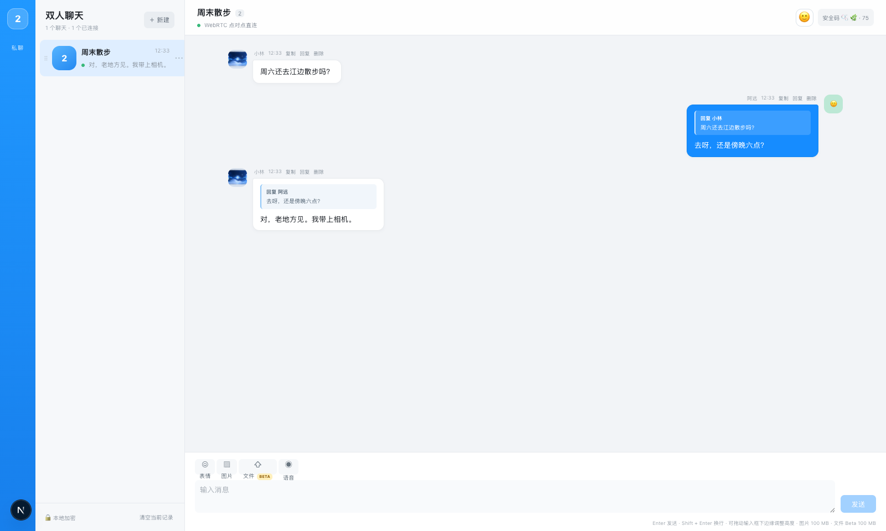

<p align="center">
  
</p>

<h1 align="center">TwoOnly</h1>

<p align="center">
  <strong>世界很吵，这里只留两个人。</strong>
  <br />
  一条邀请链接，一条点对点通道，一段只在双方浏览器里解开的对话。
</p>

<p align="center">
  <a href="https://twoonly-chat.vercel.app"></a>
  <a href="https://github.com/MarcWebber/p2p-chat/releases/tag/v1.0.0"></a>
  <a href="https://github.com/MarcWebber/p2p-chat/stargazers"></a>
</p>

<p align="center">
  
  
  
  
  
  
  
  
  
</p>

<p align="center">
  <a href="https://twoonly-chat.vercel.app"><strong>立即体验</strong></a>
  ·
  <a href="#三步开始一段对话">三步开始</a>
  ·
  <a href="#架构一瞥">架构一瞥</a>
  ·
  <a href="docs/README.md">阅读文档</a>
  ·
  <a href="docs/project-retrospective.md">项目复盘</a>
</p>

---

世界很大，浏览器之间有很长的路。

TwoOnly 只做一件事：把这条路缩短到两个人之间。没有公开广场，没有账号体系，也没有第三个席位。带着随机密钥的邀请链接让两端相遇；信令只负责敲门，消息只在双方手中解开。

> **信令让彼此找到，WebRTC 让彼此靠近，AES-GCM 让其余人保持沉默。**

## 界面一览

下图来自当前版本的真实双浏览器建连与消息收发，不是概念稿。

[](https://twoonly-chat.vercel.app)

<p align="center"><sub>点击图片，直接进入线上版本。</sub></p>

## 为什么是 TwoOnly

| 🔒 两层保护 | 🤝 真正双人 | 🪶 Local-first |
| --- | --- | --- |
| WebRTC 传输加密之外，消息还会在浏览器内使用共享随机密钥进行 AES-GCM 加密。 | 每个房间持久保存两位成员的 P-256 公钥；断线或空房后也不会把席位交给新的人。 | 房间凭证、头像和常规密文历史保存在各自设备的 IndexedDB，不建立中心化聊天档案。 |

| 🛰 双活信令 | 📦 轻重消息兼顾 | 🧭 克制的界面 |
| --- | --- | --- |
| Supabase Realtime 与同源 Vercel HTTPS 同时工作，任意一路可用即可继续协商。 | 小消息进入本地加密历史；最大 100 MB 的图片和 Beta 文件通过 DataChannel 分块传输。 | 正常聊天隐藏调试信息，只保留连接状态与安全码；脱敏诊断仍可在浏览器 Console 中用于排障。 |

## 三步开始一段对话

1. 打开 **[TwoOnly 在线体验](https://twoonly-chat.vercel.app)**，创建一个聊天。
2. 把完整邀请链接交给你想见到的那个人。
3. 双方页面保持打开；状态变为“已连接”后，就可以开始说话。

```text
创建房间  →  分享邀请链接  →  双方核对安全码  →  开始加密对话
```

邀请链接形如：

```text
https://twoonly-chat.vercel.app/?room=<roomId>#secret=<secret>&owner=<ownerPublicKey>
```

`secret` 与创建者公钥都位于 URL fragment，不会随普通 HTTP 请求发送给站点服务器。第一个通过签名验证的接收者会占据第二席位；此后即使有人拿到原链接，也不能替换原成员。请仍然只通过可信渠道分享完整链接。

## 能力地图

| 领域 | 已具备的能力 |
| --- | --- |
| 消息 | 文字、引用回复与连续盖楼、图片/头像大图查看、语音、Unicode 表情、颜文字、图片表情包、复制文字、粘贴剪贴板图片或文件 |
| 大附件 | 最大 100 MB 图片；最大 100 MB Beta 文件；192 KB 分块加密；DataChannel 高低水位背压 |
| 多聊天 | 每个已保存房间保持独立连接；切换不置顶；拖动排序；重命名；上传并裁切 200 × 200 图标 |
| 双端资料 | 聊天名称、图标、最新昵称与头像通过 AES-GCM 加密控制消息同步；历史消息按成员显示最新资料 |
| 本机资料 | 昵称与 200 × 200 裁切头像保存在 IndexedDB；修改后无需重写历史消息密文 |
| 本地管理 | 保存房间恢复密钥与最近 200 条常规密文；支持仅本机删除消息、记录或整个聊天 |
| 连接 | WebRTC DataChannel、STUN、Cloudflare TURN 短时凭证、断线重握手、手动立即重连 |
| 信令 | Supabase Realtime + Vercel HTTPS / Upstash Redis；跨通道按 `signalId` 去重 |
| 安全 | 应用层 AES-GCM、安全码、每房间 P-256 成员密钥、全信令 ECDSA 验签、输入协议校验 |

## 架构一瞥

TwoOnly 的核心不是“没有服务器”，而是把服务器的职责限制在**相遇与中继**，不让它成为聊天正文的拥有者。

[](docs/assets/twoonly-architecture-overview.png)

```text
邀请链接中的 roomId + secret
              │
              ▼
  Supabase Realtime ─┐
                     ├─ 建连信令 ─→ WebRTC DataChannel
  Vercel HTTPS/Redis ┘                    │
                                         ▼
                               AES-GCM 加密消息与控制帧
                                         │
                              ┌──────────┴──────────┐
                              ▼                     ▼
                       浏览器 A / IndexedDB   浏览器 B / IndexedDB
```

### 建连与排障图谱

| 从哪里开始查 | 正常建连时序 | TURN 证据等级 |
| --- | --- | --- |
| [](docs/assets/faq-01-connection-troubleshooting.png) | [](docs/assets/faq-02-peer-connection-sequence.png) | [](docs/assets/faq-03-turn-evidence-levels.png) |

## 技术栈

```text
Next.js 16 · React 19 · TypeScript 5.9 · Less
WebRTC · RTCDataChannel · Web Crypto / AES-GCM
IndexedDB · Supabase Realtime · Upstash Redis · Vercel · Cloudflare TURN
```

代码按 `chat / crypto / signal / webrtc / storage / room / media / ui` 拆分。入口只负责组合，协议、持久化和连接生命周期分别拥有自己的边界。

## 本地运行

要求 Node.js `>= 22`。

```bash
git clone https://github.com/MarcWebber/p2p-chat.git
cd p2p-chat
npm install
cp .env.example .env.local
npm run dev
```

至少配置 Supabase 或 Upstash HTTPS 信令中的一路，然后从两个浏览器或设备打开同一条邀请链接。

最小 Supabase 配置：

```dotenv
NEXT_PUBLIC_SUPABASE_URL=https://YOUR_PROJECT.supabase.co
NEXT_PUBLIC_SUPABASE_PUBLISHABLE_KEY=sb_publishable_xxx
```

如需 HTTPS 降级信令，可在 Vercel Marketplace 连接 Upstash Redis，或手工设置：

```dotenv
UPSTASH_REDIS_REST_URL=https://YOUR_DATABASE.upstash.io
UPSTASH_REDIS_REST_TOKEN=xxx
```

详细说明见 [Supabase + Vercel HTTPS 双活信令](docs/signaling-resilience.md) 与 [部署运维手册](docs/deployment-operations.md)。

## 部署

<p>
  <a href="https://vercel.com/new/clone?repository-url=https://github.com/MarcWebber/p2p-chat"></a>
</p>

Vercel 使用默认 Next.js 构建命令即可。生产环境建议同时配置 Supabase、Upstash 与 TURN，并设置：

```dotenv
NEXT_PUBLIC_SITE_URL=https://your-domain.example
```

## 安全与边界

TwoOnly 是共享随机会话秘密驱动的应用层加密 P2P 聊天，并为每个房间单独保存两位成员的签名密钥；它仍然没有账号或跨设备身份系统。

- 双方必须同时在线才能实时收到消息；当前没有离线信箱或后台 Push。
- 新房间在创建者在线时由第一个成功验签的接收者占据第二席位；首次认领前仍应防止邀请链接泄露。
- 成员名单与私钥保存在双方 IndexedDB；锁屏、断线、页面关闭或 peer lock 超时都不会允许陌生公钥接替。
- 清除站点数据、删除本机聊天或复制浏览器存储会分别造成成员凭证丢失或被复制；本项目不使用硬件安全区、MAC 地址或浏览器指纹。
- 升级前的旧记录没有历史成员证据：仍保存该房间的端点中，最先完成新版相互验签的两端会被锁定，系统无法证明它们就是最初两人；没有本地旧房间记录的无公钥旧邀请会被拒绝。
- 消息与聊天删除只影响执行操作的浏览器，不同步 tombstone。
- 常规密文历史每个房间最多保留 200 条；大于 1.5 MB 的流式附件刷新后不会恢复。
- IndexedDB 不是硬件安全区；本机用户、恶意扩展或已控制页面环境的脚本仍可能接触密钥或明文。
- 当前不支持实时音视频通话，也不承诺严格 NAT、企业网络或中国大陆网络下无需 TURN 即可直连。

更完整的威胁模型见 [WebRTC、双工通道与加密](docs/webrtc-security.md)。

## 文档宇宙

| 文档 | 适合什么时候读 |
| --- | --- |
| [文档入口](docs/README.md) | 想先看全局目录 |
| [系统架构与文件结构](docs/architecture.md) | 想理解模块边界和数据流 |
| [WebRTC 与加密 P2P 实战分享](docs/field-guide.md) | 想从工程实践理解整个项目 |
| [常见问题与网络排障 FAQ](docs/faq.md) | 连不上、想定位 STUN/TURN/信令问题 |
| [VPS、Socket.IO、Vercel 和 TURN](docs/network-and-deployment.md) | 想理解不同部署路线的取舍 |
| [Supabase、Vercel 与部署运维](docs/deployment-operations.md) | 准备上线或维护生产环境 |
| [项目最终复盘](docs/project-retrospective.md) | 想知道为什么做到这里、边界又在哪里 |

## 表情素材

图片表情包来自 [Microsoft Fluent Emoji](https://github.com/microsoft/fluentui-emoji)，采用 MIT License；授权文本保存在 [`public/stickers/fluent/LICENSE.txt`](public/stickers/fluent/LICENSE.txt)。发送时素材从本地静态资源读取，不依赖第三方图片服务。

---

<p align="center">
  <strong>不是所有话都需要被世界听见。</strong>
  <br />
  <sub>有些话，只需要安全地抵达另一个人。</sub>
  <br /><br />
  <a href="https://twoonly-chat.vercel.app">打开 TwoOnly</a>
</p>
