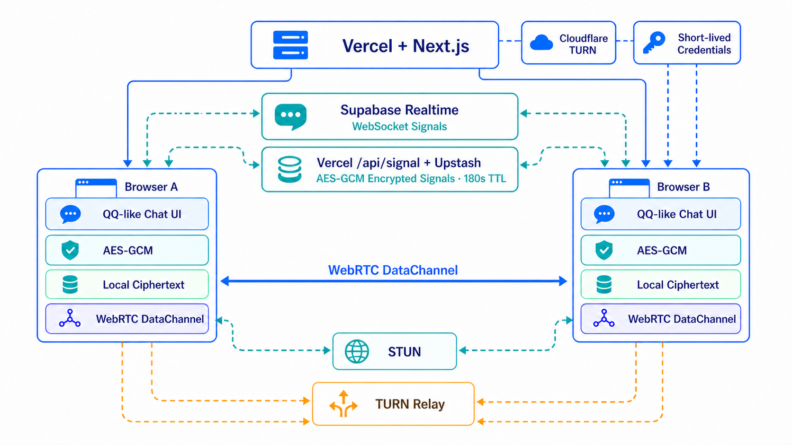

# TwoOnly 技术文档

TwoOnly 是一个纯浏览器双人加密聊天项目。网页由 Next.js 构建并部署到 Vercel；Supabase Realtime 只负责让两个浏览器交换 WebRTC 建连所需的信令；文字、图片和语音经浏览器本地 AES-GCM 加密后，通过 WebRTC DataChannel 传输，并以密文保存在各自设备的 `localStorage`。

## 推荐阅读顺序

如果你想从原理一直读到实战收尾，建议按下面三篇走：

1. [从一条邀请链接到一条加密 P2P 通道](field-guide.md)：用 TwoOnly 串起信令、ICE、STUN、TURN、DataChannel、AES-GCM、本地历史和重连。
2. [VPS、Socket.IO、Vercel 和 TURN](network-and-deployment.md)：解释常驻 Node 服务、托管信令、平台 Function 和中继服务分别适合放什么。
3. [TwoOnly 项目复盘](project-retrospective.md)：记录模块化过程、真实故障、生产部署、验收证据和项目边界。
4. [常见问题与网络排障 FAQ](faq.md)：回答“开了 TURN 为什么还失败”，并给出从凭证、relay candidate、选中路径到双向流量的完整证据链。

这组文档偏经验分享，代码很少，流程图比较多。想直接查配置或实现细节，再进入下面的专题手册。

## 专题手册

- [系统架构与文件结构](architecture.md)：组件边界、消息流、双人限制和源码目录。
- [代码规模与复杂度基线](code-metrics.md)：当前行数、目录分布、复杂度代理和重复统计方法。
- [WebRTC、双工通道与加密](webrtc-security.md)：Offer/Answer、ICE、STUN/TURN、DataChannel、AES-GCM、分片、威胁边界。
- [TURN 配置手册](turn-configuration.md)：托管服务和 Coturn 自建方式、端口、证书、Vercel 环境变量与验收。
- [常见问题与网络排障 FAQ](faq.md)：TURN 可达性、两端状态不一致、重连、国内网络和常见产品边界。
- [Supabase 不可达时的信令容灾方案](signaling-resilience.md)：双活信令、VPS Socket.IO 备用服务、去重、灰度与验收矩阵。
- [Supabase、Vercel 与部署运维](deployment-operations.md)：环境变量、Supabase 配置、Vercel 部署、测试和国内访问方案。

## 一张图看懂

图片负责快速建立空间感和排障顺序；发生差异时，以源码和专题手册为准。

## 当前实现摘要

| 项目 | 当前实现 |
| --- | --- |
| 前端 | Next.js 16、React 19、TypeScript 5 |
| 实时数据 | WebRTC `RTCDataChannel`，可靠且按序 |
| 信令 | Supabase Realtime Broadcast；属于必需配置，缺失时明确报告不可用 |
| 协商协议 | protocol v2；双方 Hello，participant ID 确定临时 Offer 发起方，epoch + negotiation ID 隔离重连轮次 |
| 应用层加密 | Web Crypto API，随机会话秘密经 SHA-256 导入为 AES-GCM 密钥，每条消息使用独立 12 字节 IV |
| 历史记录 | 每台设备的 `localStorage`，仅保存 `{id, iv, data}` 密文，最多 200 条 |
| 消息类型 | 文字、图片、语音；图片/语音单条上限 1.5 MB |
| 大消息处理 | 加密后 JSON 按 12,000 字符分片，在接收端重组并解密 |
| 部署 | Vercel 静态页面与短时 Cloudflare TURN 凭证接口；Supabase 新加坡区提供 WebSocket 信令 |

## 必须理解的边界

- “P2P”指聊天负载优先由两个浏览器直接传输。若配置 TURN 且直连失败，数据会经过 TURN 中继，但仍由 WebRTC 传输层和应用层 AES-GCM 保护。
- Supabase 看不到聊天正文，但会处理房间 topic、SDP、ICE Candidate 等建连元数据。
- 历史只在本机，双方离线时没有服务器信箱，也不会跨设备同步。
- “只允许两个人”由双方页面内存中的运行时 peer lock 实现，不是账号或服务端身份系统；页面全部关闭后没有持久席位。
- 拿到完整邀请链接的人拥有会话秘密，可能作为参与者加入。请通过可信渠道分享，并在双方页面核对安全码。
- Cloudflare TURN key 和 API token 只保存在 Vercel 服务端；浏览器按页面会话获取 24 小时临时凭证。
- TURN 解决 NAT/防火墙穿透，不等于中国大陆网络保障；网页、Supabase WebSocket 和 Cloudflare TURN 仍需分别实测。

## 官方参考

- [WebRTC Peer Connection 入门](https://webrtc.org/getting-started/peer-connections)
- [W3C WebRTC 规范](https://www.w3.org/TR/webrtc/)
- [W3C Web Crypto API](https://www.w3.org/TR/WebCryptoAPI/)
- [Supabase Realtime Broadcast](https://supabase.com/docs/guides/realtime/broadcast)
- [Vercel 环境变量](https://vercel.com/docs/environment-variables)
- [Socket.IO 工作原理](https://socket.io/docs/v4/how-it-works/)
- [Cloudflare TURN 短时凭证](https://developers.cloudflare.com/realtime/turn/generate-credentials/)
