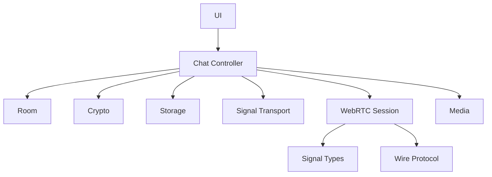

# 系统架构与文件结构

## 1. 总体架构


Vercel 提供静态网页与资源，并通过 `/api/turn-credentials` 用服务端 Cloudflare Token 生成短时 TURN 配置。该 Function 不接收聊天正文。Supabase 只在 WebRTC 建连阶段交换信令；连接成功后，应用消息走 DataChannel，代码不会把聊天正文写入 Supabase Database、Storage 或 Vercel Function。

## 2. 运行时组件

### Next.js 页面层

- `app/layout.tsx`：页面元数据、Open Graph 分享图、站点基础 URL。
- `app/page.tsx`：渲染唯一的聊天客户端组件。
- `app/globals.css`：启动页、桌面聊天、移动端聊天、连接状态和操作反馈样式。

页面本身可静态预渲染；TURN credential Route Handler 按请求动态运行。WebRTC、Web Crypto、录音、文件读取和本地存储仍全部在浏览器端执行。

### 聊天客户端

`components/TwoOnlyApp.tsx` 现在只是客户端边界：调用聊天控制器，再把结果交给 UI。具体职责拆分如下：

| 模块 | 职责 | 不负责 |
| --- | --- | --- |
| `src/chat` | 领域类型、React 状态和用例编排 | WebRTC/Supabase 的底层细节 |
| `src/crypto` | 随机值、安全码、AES-GCM 加解密 | 保存历史、发送网络消息 |
| `src/signal` | 信令类型校验、Supabase/BroadcastChannel 适配 | 聊天正文、PeerConnection 生命周期 |
| `src/webrtc` | Offer/Answer、ICE、DataChannel、重连和密文分片传输 | React UI、本地历史 |
| `src/storage` | `localStorage` 密文历史、`sessionStorage` 发送方身份 | 加解密、Supabase Database/Storage |
| `src/room` | 邀请链接解析、生成和角色判断 | 连接状态机 |
| `src/media` | 文件 Data URL、文件限制、录音生命周期 | 消息加密和发送 |
| `src/protocol` | 密文信封的分片编码、重组和协议格式 | 网络连接、明文消息 |
| `src/ui` | 首页、聊天页和展示组件 | 直接访问 Supabase、WebRTC 或浏览器存储 |

这里特别需要区分：Supabase 当前只提供 Realtime Broadcast 信令，不保存聊天消息，因此它属于 `signal`，不是 `storage`。`storage` 只封装当前浏览器内的持久化。

## 3. 邀请链接与房间身份

房主创建聊天时生成两个随机值：

```text
roomId = randomToken(9)      # Supabase topic 标识
secret = randomToken(32)     # 约 256 位随机会话秘密
```

邀请链接格式：

```text
https://站点/?room=<roomId>&role=guest#<secret>
```

- `room` 用于选择信令 topic：`twoonly:<roomId>`。
- `role` 决定浏览器以房主还是访客身份参与 Offer/Answer。
- `secret` 放在 URL Fragment 中，浏览器不会把 Fragment 作为 HTTP 请求路径发送给 Vercel；客户端脚本从 `window.location.hash` 读取它并派生 AES 密钥。
- 房主与访客显示从同一 `secret` 计算出的安全码，用户可通过另一个可信渠道核对。

## 4. “只允许两个人”的实现

每个浏览器实例生成一个随机 `senderId`。访客订阅信令频道后周期性发送 `hello`；房主的 `WebRtcSession` 收到首个访客后锁定其 `senderId`，并只向该 ID 发送 Offer、Answer 相关消息。后续不同 ID 会收到 `rejected`。

这能满足临时双人房间的 MVP 需求，但有三个明确限制：

1. 锁存在房主内存中，房主刷新后会丢失。
2. 没有账号或公钥身份，先到达的访客占用唯一位置。
3. 公共 Broadcast topic 不是访问控制；随机 `roomId` 和邀请秘密降低误入概率，但不是认证机制。

若要升级为严格的双人产品，应增加一次性邀请核销、持久化成员公钥、签名握手和私有 Realtime Channel 授权。

## 5. 状态与生命周期

连接状态为 `waiting → connecting → connected`，失败或关闭后进入 `disconnected`。新建聊天会同时清理：

- 旧 PeerConnection 与 DataChannel；
- 对方身份锁、协商 ID、已处理 Offer 和待处理 ICE；
- 未完成消息分片、输入框和当前消息列表；
- 连接模式和提示状态。

`WebRtcSession` 统一持有 PeerConnection、DataChannel、协商 ID、信令队列和定时器。PeerConnection、DataChannel 与消息回调都会检查自己是否仍是当前实例；控制器销毁会话后，旧实例也不能再写入 React 状态，避免异步 `close` 或 `message` 污染新房间。

## 6. 文件结构

```text
twoonly/
├── app/
│   ├── globals.css                 # 全局与响应式 UI
│   ├── layout.tsx                  # 元数据和根布局
│   └── page.tsx                    # 首页入口
├── components/
│   └── TwoOnlyApp.tsx              # 10 行客户端入口
├── src/
│   ├── chat/
│   │   ├── types.ts                # 聊天领域类型
│   │   └── useTwoOnlyChat.ts       # 状态与用例协调器
│   ├── crypto/
│   │   └── messageCrypto.ts        # 随机值、安全码、AES-GCM
│   ├── media/
│   │   ├── files.ts                # 文件限制与 Data URL
│   │   └── useAudioRecorder.ts     # 录音生命周期
│   ├── protocol/
│   │   └── wireProtocol.ts         # 密文分片编码与重组
│   ├── room/
│   │   └── invitation.ts           # 房间 URL 与邀请链接
│   ├── signal/
│   │   ├── types.ts                # 信令协议与结构校验
│   │   └── signalTransport.ts      # Supabase/本地信令适配器
│   ├── storage/
│   │   └── chatStorage.ts          # 密文历史与发送方身份
│   ├── ui/
│   │   ├── TwoOnlyView.tsx         # 页面状态分流
│   │   ├── LandingScreen.tsx       # 首页与 Wiki
│   │   ├── ChatScreen.tsx          # 聊天页组合
│   │   ├── ChatHeader.tsx          # 状态与房间操作
│   │   ├── ChatSidebar.tsx         # 当前会话摘要
│   │   ├── MessageList.tsx         # 消息展示
│   │   ├── MessageComposer.tsx     # 文字/图片/语音输入
│   │   └── formatters.ts           # UI 格式化
│   └── webrtc/
│       ├── WebRtcSession.ts        # Peer、握手、重连状态机
│       └── iceConfig.ts            # STUN/TURN 配置
├── docs/
│   ├── README.md                   # 文档索引
│   ├── architecture.md             # 本文
│   ├── deployment-operations.md    # Supabase/Vercel/运维
│   ├── turn-configuration.md       # TURN 配置
│   └── webrtc-security.md          # 通道与安全实现
├── public/
│   ├── og.jpg                      # 分享卡片
│   └── og.png                      # 分享卡片源图
├── .env.example                    # 环境变量模板
├── next.config.ts                  # Next.js 配置
├── package.json                    # 依赖与命令
├── package-lock.json               # 锁定后的依赖树
├── tsconfig.json                   # TypeScript 配置
└── README.md                       # 项目说明
```

## 7. 依赖方向与扩展规则



后续开发应保持以下边界：

- UI 只能调用控制器暴露的状态和动作，不直接操作 `RTCPeerConnection`、Supabase 或浏览器存储；
- Signal 只传递并校验信令结构，不依赖具体 UI；
- WebRTC 只传输 `EncryptedWire`，不持有 AES 密钥或明文消息；
- Storage 只保存密文信封，不自行加解密；
- Crypto 的密钥实例绑定单个房间秘密，不能跨房间复用；
- 当前 Signal 只有结构校验和目标 ID 路由，没有数字签名。未来增加信令认证时，应在 Crypto 中增加独立的 HMAC/签名模块，而不是把它伪装成已有能力。
