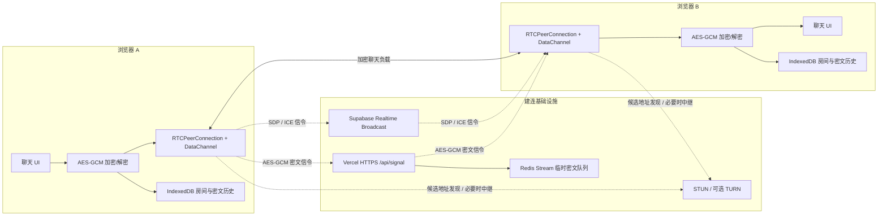
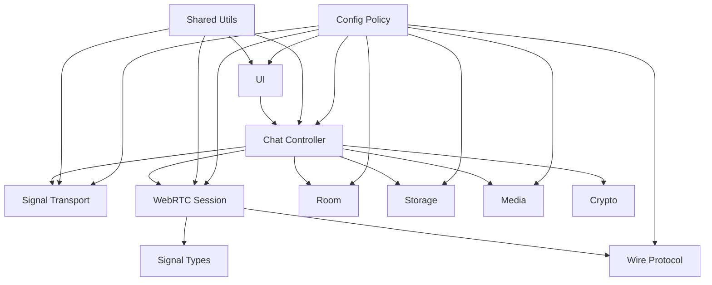

# 系统架构与文件结构


这张图用于快速理解组件位置；下方 Mermaid 图用于准确表达数据流。总览图由 OpenAI ImageGen 生成。

## 1. 总体架构



Vercel 提供静态网页与资源，通过 `/api/turn-credentials` 生成短时 TURN 配置，并通过 `/api/signal` 提供同源 HTTPS 信令。Supabase 与 HTTPS 在 WebRTC 建连阶段双活；HTTPS payload 先由浏览器用邀请密钥加密，Redis 最多保留约 128 条并在 180 秒后过期。连接成功后，应用消息走 DataChannel，聊天正文不会写入 Supabase、Redis 或 Vercel Function。

## 2. 运行时组件

### Next.js 页面层

- `app/layout.tsx`：页面元数据、Open Graph 分享图、站点基础 URL。
- `app/page.tsx`：渲染唯一的聊天客户端组件。
- `app/globals.css`：启动页、桌面聊天、移动端聊天、连接状态和操作反馈样式。

页面本身可静态预渲染；TURN credential 与 HTTPS signal Route Handler 按请求动态运行。WebRTC、Web Crypto、录音、文件读取和本地存储仍全部在浏览器端执行。

### 聊天客户端

`components/TwoOnlyApp.tsx` 现在只是客户端边界：调用聊天控制器，再把结果交给 UI。具体职责拆分如下：

| 模块 | 职责 | 不负责 |
| --- | --- | --- |
| `src/config` | 产品策略、公开环境配置、服务端环境配置 | 业务流程、网络请求、UI 状态 |
| `src/chat` | 领域类型、React 状态和用例编排 | WebRTC/Supabase 的底层细节 |
| `src/crypto` | 随机值、安全码、AES-GCM 加解密 | 保存历史、发送网络消息 |
| `src/diagnostics` | 建连日志、脱敏、内存环形缓冲和 Console 输出 | 持久化日志、记录密钥或消息内容 |
| `src/signal` | 信令校验、Supabase/HTTPS 适配、双发去重和短时 Redis Stream | 聊天正文、PeerConnection 生命周期 |
| `src/server` | Route Handler 共用的同源请求校验 | 浏览器状态、房间密钥 |
| `src/webrtc` | Offer/Answer、ICE、DataChannel、重连和 ICE Server 规范化 | React UI、本地历史 |
| `src/storage` | IndexedDB 房间目录、密文历史与本机消息方向 | 加解密、Supabase Database/Storage |
| `src/room` | 无角色邀请链接的解析与生成 | 连接状态机 |
| `src/media` | 录音生命周期 | 消息加密、通用浏览器文件转换 |
| `src/protocol` | 密文信封的分片编码、重组和协议格式 | 网络连接、明文消息 |
| `src/ui` | 首页、聊天页和展示组件 | 直接访问 Supabase、WebRTC 或浏览器存储 |
| `src/utils` | 剪贴板、Data URL、时间/容量格式、短 ID 和通用类型守卫 | 领域状态、网络策略、服务端秘密 |

这里特别需要区分：Supabase 和 Redis 都只承担建连信令，不保存聊天消息，因此属于 `signal`，不是聊天 `storage`。`storage` 只封装当前浏览器内的持久化。

### 配置边界

配置分为三层，避免业务代码直接散读环境变量：

- `config/policy.ts` 是环境无关的产品策略，集中保存附件上限、存储容量、协议版本、RTC 超时、Candidate 缓存上限和资源命名；
- `config/publicRuntime.ts` 只解析 `NEXT_PUBLIC_*`，生成可进入浏览器包的 Supabase 与静态 ICE 配置；
- `config/serverRuntime.ts` 以 `server-only` 标记，保存站点地址、Cloudflare TURN Key/Token 和 Upstash REST 凭据。客户端模块一旦误引入它，Next.js 会在构建期报错。

配置只描述值和环境，不执行握手或请求。通用行为放在 `utils`，ICE 领域行为放在 `webrtc/iceServers.ts`。例如服务端 TURN Route 与浏览器凭据解析现在共用 `normalizeIceServer` / `hasTurnServer`，不会再各维护一套校验规则。

## 3. 邀请链接与页面身份

任意一端创建聊天时生成两个随机值：

```text
roomId = randomToken(9)      # Supabase topic 标识
secret = randomToken(32)     # 约 256 位随机会话秘密
```

邀请链接格式：

```text
https://站点/?room=<roomId>#<secret>
```

- `room` 用于选择 Supabase topic 和 Redis Stream：`twoonly:<roomId>` / `twoonly:https-signal:<roomId>`。
- `secret` 放在 URL Fragment 中，浏览器不会把 Fragment 作为 HTTP 请求路径发送给 Vercel；客户端脚本从 `window.location.hash` 读取它并派生 AES 密钥。
- 两端显示从同一 `secret` 计算出的安全码，用户可通过另一个可信渠道核对。
- 每次页面加载都会生成新的随机 `participantId`。它用于本次页面的信令寻址和 Offer 发起方选举，不是账号或长期设备身份。

解析器只读取 `room` 和 fragment 中的 `secret`。URL 中的其他参数不会进入邀请对象，也不会影响谁发送 Offer、创建 DataChannel 或恢复消息方向。

## 4. “只允许两个人”的实现

每个页面实例生成随机 `participantId`，并在 Supabase 或 HTTPS 至少一条信令可用后周期性广播 protocol v2 `hello`。同一信令携带 `signalId` 并发送到所有通道，重复到达时在进入状态机前丢弃。双方收到对方 Hello 后各自在内存中锁定同一个 peer，并通过 `participantId` 字符串比较得到一致结论：较小 ID 是本轮临时 Offer 发起方，同时创建 DataChannel；另一端处理 Offer 并返回 Answer。连接打开后，两端能力完全相同，没有长期房主或访客角色。

信令同时携带 `fromEpoch`、面向对端的 `toEpoch` 和每轮随机 `negotiationId`。本端重连时递增 local epoch；收到对方更大的 remote epoch 时关闭旧 Peer 并进入新轮次。Answer 和 Candidate 必须同时命中参与者、双方 epoch 与 negotiation ID；远端描述尚未就绪时，Candidate 也按这组键分桶缓存，避免旧轮次污染新连接。

第三个页面广播 Hello 时，两个已连接页面都会因为 peer lock 已被占用而回复 `rejected(room-full)`。DataChannel 已打开时不会因超时让位；只有通道没有打开，并且旧 Peer 已明确失败/关闭，或连续 10 秒没有旧 peer 信令时，锁才允许新的页面实例接替。这是一种运行时恢复策略，不是服务端成员认证。

这能满足临时双人房间的 MVP 需求，但有四个明确限制：

1. 锁分别存在两个页面的内存中；页面全部关闭后没有持久成员席位。
2. 没有账号或公钥身份，拿到完整链接并先完成互锁的页面占用位置。
3. 公共 Broadcast topic 不是访问控制；随机 `roomId` 和邀请秘密降低误入概率，但不是认证机制。
4. 三个页面近同时首次进入时，可能因 Hello 到达顺序不同形成临时非对称锁；当前没有服务端成员槽仲裁，需关闭多余页面后重连。

若要升级为严格的双人产品，应增加一次性邀请核销、持久化成员公钥、签名握手和私有 Realtime Channel 授权。

## 5. 状态与生命周期

每个房间的连接状态都是 `waiting → connecting → connected`，失败或关闭后进入 `disconnected`。聊天控制器按 `roomId` 保存一组 `RoomRuntime`；每个运行时独立持有随机页面级 `participantId`、消息加密器、信令传输、`WebRtcSession`、消息和诊断状态。IndexedDB 的 `rooms` object store 继续以 `roomId` 为唯一键，不生成或保存 MAC、deviceId 或浏览器指纹。

页面启动时会为全部已保存房间创建运行时。侧栏切换只更新当前展示的 `activeRoomId`、URL 和输入状态，不销毁其他房间的 PeerConnection、DataChannel 或信令订阅；只有房间凭证被替换、房间被移除或页面卸载时才释放对应运行时。因此一台机器可以同时维持多个彼此独立的双人房间，而每个房间内部仍由 `PeerLock` 限制为一个对端。

`WebRtcSession` 现在使用单一 `phase`（discovering / negotiating / connected / full / disposed）表达主生命周期，而不是让十几个布尔值互相组合。实例创建后已经具备发现能力，信令就绪才启动 Hello 定时器，因此不再保留没有独立行为的 `idle` 和空 `start()`。对端身份收敛为一条 `PeerLock`，本轮 Offer/Answer 收敛为一条 `Negotiation`，三个定时器统一放在 `Timers` 中；重连或换届时通过一个入口清理 Peer、协商和 Candidate 缓存。PeerConnection、DataChannel 与异步 SDP 回调仍会检查自己是否属于当前协商，避免旧实例污染新房间。

诊断日志统一经过 `trace(stage, code, message, options)`，连接状态和用户提示统一经过 `show(...)`。这两个入口保留了完整排障证据链，但删除了散落在主流程里的重复日志对象。Candidate 解析和最终 Candidate Pair 统计移到纯函数模块 `rtcStats.ts`，不再挤占会话状态机。

聊天消息中的 `author` 使用 `self / peer`，只表达本机 UI 方向。方向元数据随密文写入 IndexedDB，刷新或关闭标签页后仍可恢复。存储层只读取当前 IndexedDB 结构；无效记录会明确失败，不再回退到旧存储或猜测消息方向。

## 6. 文件结构

```text
twoonly/
├── app/
│   ├── api/signal/
│   │   └── route.ts                # 同源 HTTPS 信令入口
│   ├── api/turn-credentials/
│   │   └── route.ts                # Cloudflare TURN 短时凭据与请求追踪
│   ├── globals.css                 # 全局与响应式 UI
│   ├── layout.tsx                  # 元数据和根布局
│   └── page.tsx                    # 首页入口
├── components/
│   └── TwoOnlyApp.tsx              # 客户端入口与首页/聊天页分流
├── src/
│   ├── config/
│   │   ├── policy.ts              # 产品限制、协议与 RTC 策略
│   │   ├── publicRuntime.ts       # NEXT_PUBLIC 环境配置
│   │   └── serverRuntime.ts       # server-only 站点、TURN 与 Redis 配置
│   ├── chat/
│   │   ├── types.ts                # 聊天领域类型
│   │   └── useTwoOnlyChat.ts       # 状态与用例协调器
│   ├── crypto/
│   │   ├── aesGcm.ts               # 通用 AES-GCM JSON 信封
│   │   └── messageCrypto.ts        # 随机值、安全码、聊天加解密
│   ├── diagnostics/
│   │   └── connectionDiagnostics.ts # 脱敏建连日志与内存缓冲
│   ├── media/
│   │   └── useAudioRecorder.ts     # 录音生命周期
│   ├── protocol/
│   │   └── wireProtocol.ts         # 密文分片编码与重组
│   ├── room/
│   │   └── invitation.ts           # 房间 URL 与邀请链接
│   ├── signal/
│   │   ├── types.ts                       # 信令协议与结构校验
│   │   ├── supabaseSignalTransport.ts     # Supabase WebSocket 信令
│   │   ├── httpsSignalTransport.ts        # 浏览器同源 HTTPS 信令
│   │   ├── httpsSignalProtocol.ts         # HTTPS 请求/响应校验
│   │   ├── serverSignalStore.ts           # 服务端 Redis Stream
│   │   └── signalTransport.ts             # 双活聚合与去重
│   ├── server/
│   │   └── requestSecurity.ts      # Route 同源请求校验
│   ├── storage/
│   │   └── chatStorage.ts          # 密文历史与本标签发送消息 ID
│   ├── ui/
│   │   ├── LandingScreen.tsx       # 首页与 Wiki
│   │   ├── ChatScreen.tsx          # 聊天页组合
│   │   ├── ChatHeader.tsx          # 状态与房间操作
│   │   ├── ConnectionDiagnosticsPanel.tsx # 六阶段连接诊断面板
│   │   ├── ChatSidebar.tsx         # 当前会话摘要
│   │   ├── MessageList.tsx         # 消息展示
│   │   └── MessageComposer.tsx     # 文字/图片/语音/视频输入
│   ├── utils/
│   │   ├── browser.ts              # 剪贴板与 Data URL
│   │   ├── format.ts               # 时间、容量与短 ID 格式
│   │   ├── guards.ts               # 通用运行时类型守卫
│   │   └── ids.ts                  # Trace ID
│   └── webrtc/
│       ├── WebRtcSession.ts        # Peer、握手、重连状态机
│       ├── iceConfig.ts            # STUN/TURN 配置
│       ├── iceServers.ts           # ICE Server 校验与摘要
│       └── rtcStats.ts             # Candidate 摘要与选中路径统计
├── docs/
│   ├── README.md                   # 文档索引
│   ├── field-guide.md              # WebRTC 原理与项目实战主线
│   ├── network-and-deployment.md   # VPS、Socket.IO 与部署选择
│   ├── project-retrospective.md    # 故障、验收与最终复盘
│   ├── architecture.md             # 本文
│   ├── code-metrics.md             # 代码规模和复杂度基线
│   ├── deployment-operations.md    # Supabase/Vercel/运维
│   ├── turn-configuration.md       # TURN 配置
│   ├── faq.md                      # 常见问题与连接排障
│   ├── webrtc-security.md          # 通道与安全实现
│   └── assets/                     # 架构总览与 FAQ 编号流程图
├── public/
│   ├── og.jpg                      # 分享卡片
│   └── og.png                      # 分享卡片源图
├── .env.example                    # 环境变量模板
├── next.config.ts                  # Next.js 配置
├── package.json                    # 依赖与命令
├── package-lock.json               # 锁定后的依赖树
├── tsconfig.json                   # TypeScript 配置
└── README.md                       # 项目说明
```

## 7. 依赖方向与扩展规则



后续开发应保持以下边界：

- UI 只能调用控制器暴露的状态和动作，不直接操作 `RTCPeerConnection`、Supabase 或浏览器存储；
- 业务模块不直接读取 `process.env`；公开变量只能进入 `publicRuntime.ts`，长期 Token 只能进入 `serverRuntime.ts`；
- `policy.ts` 只保存跨模块策略与协议值，组件独有文案和展示映射留在组件附近，防止配置文件变成新的杂物间；
- `utils` 只接收普通参数并返回结果，不反向依赖 Chat、Signal 或 WebRTC 状态机；
- Signal 只传递并校验信令结构，不依赖具体 UI；
- WebRTC 只传输 `EncryptedWire`，不持有 AES 密钥或明文消息；
- Storage 只保存密文信封，不自行加解密；
- Crypto 的密钥实例绑定单个房间秘密，不能跨房间复用；
- 当前 Signal protocol v2 只做结构、版本、目标 ID、epoch 与协商轮次校验，没有数字签名。未来增加信令认证时，应在 Crypto 中增加独立的 HMAC/签名模块，而不是把它伪装成已有能力。
