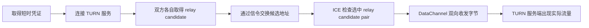

# TwoOnly 常见问题与网络排障 FAQ

这份 FAQ 记录的是项目实际踩过的坑。重点不是背 WebRTC 名词，而是拿到一条可验证的证据链：到底是网页没打开、信令没通、TURN 没分配地址，还是已经分配了地址但最终链路仍然没建立。

## 先说结论：有 TURN，也不能保证 100% 建联

TURN 是 WebRTC 在直连失败时的重要兜底，但它不是“只要开通就一定连接”的开关。一次真正可用的中继连接至少要连续通过下面几层：

前一层成功，只能说明前一层，不自动证明后一层。例如 `/api/turn-credentials` 返回 `200`，只能说明浏览器拿到了地址和临时账号；它不能证明当前网络能连上 TURN，也不能证明 ICE 最终选中了中继路径。

## 如何确定对方能够访问 TURN？

不要只在房主设备测试。房主和访客应当分别在各自真实网络完成下面的检查。

| 验证层级 | 怎么看 | 成功能证明什么 | 仍然不能证明什么 |
| --- | --- | --- | --- |
| 1. 凭证 | 浏览器 Network 中 `/api/turn-credentials` 返回 `200`，响应含 `iceServers` | Vercel 接口和 Cloudflare 凭证生成正常 | 对方网络能访问 TURN |
| 2. 分配 | 用 Trickle ICE 收集到 `relay` candidate | 这台设备、这个浏览器、当前网络能向 TURN 创建 allocation | 两个浏览器能够建成一条会话 |
| 3. 选路 | 强制 relay 后，两端实际选中的 Candidate Pair 含 `relay` | ICE 已经选中 TURN 中继路径 | 应用数据一定正常、连接能够长期维持 |
| 4. 数据 | Candidate Pair 的 `bytesSent`、`bytesReceived` 在双向发消息时持续增长 | WebRTC 数据确实双向经过该候选对 | 服务端是否观察到同一流量 |
| 5. 服务端 | Cloudflare TURN Analytics 同期出现连接数和 ingress/egress bytes | TURN 边缘确实中继了流量 | 应用消息是否被正确解密和展示 |

### 最可靠的现场测试

1. 在生产环境临时设置 `NEXT_PUBLIC_ICE_TRANSPORT_POLICY=relay`，重新部署。该变量是前端构建变量，仅修改而不重新部署不会生效。
2. 房主和访客分别使用待验证的真实网络打开全新的页面，避免用同一台设备、同一 Wi-Fi 得出结论。
3. 两端都应建立连接，并显示“TURN 加密中继”。若只显示“WebRTC 已连接”，浏览器统计可能尚未提供可判定的候选对，继续看 WebRTC 内部统计。
4. 双方各发送一条文字消息，再发送一张小图片。只有双向都成功才算通过。
5. 在 Chromium 打开 `chrome://webrtc-internals`，找到本次 `RTCPeerConnection`，确认 selected/nominated Candidate Pair 的状态为 `succeeded`，候选类型含 `relay`，并观察 `bytesSent` 与 `bytesReceived` 都在增加。Firefox 可查看 `about:webrtc`。
6. 在 Cloudflare TURN Analytics 对照测试时间检查 `concurrentConnections`、`ingressBytes` 和 `egressBytes`。
7. 测完把 `NEXT_PUBLIC_ICE_TRANSPORT_POLICY` 恢复为 `all` 并重新部署。日常强制中继会增加延迟和 TURN 流量成本，也失去直连优势。

如果第 2 层失败，就是“对方访问不了 TURN”或认证/服务配置问题；如果第 2 层成功、第 3 层失败，则重点查 ICE 信令、候选交换和连通性检查；如果第 3 层成功、第 4 层失败，则重点查 DataChannel、页面生命周期和应用协议。

### 用 Trickle ICE 单独测试某一台设备

[WebRTC 官方 Trickle ICE 页面](https://webrtc.github.io/samples/src/content/peerconnection/trickle-ice/)适合把 TwoOnly 和 TURN 分开测试：

1. 在该设备上打开 TwoOnly，进入开发者工具的 Network。
2. 查看 `/api/turn-credentials` 的响应，临时复制其中一组 `urls`、`username` 和 `credential`。这些是短时敏感凭证，不要截图公开，也不要写入文档或 Git。
3. 在 Trickle ICE 删除默认服务器，只添加一条待测 TURN 地址。
4. 点击 **Gather candidates**，结果中出现 `relay` 才表示当前浏览器和网络完成了 TURN allocation。
5. 将 UDP、TCP、TLS 地址拆开逐条测，记录哪一种能成功。

Trickle ICE 只验证“这台设备能否取得中继候选地址”，不是双端聊天验收。完整结论仍要靠强制 relay 的两端实测。

## 为什么开了 TURN 仍然可能失败？

常见原因不止“对方完全访问不了 relay”：

- 对方能访问 Vercel 凭证接口，却无法解析或连接 TURN 主机。
- UDP 被公司、校园网、代理或运营商封锁，而 TCP/TLS 备用地址也被过滤或没有正确配置。
- 临时用户名或密码已过期、撤销或签发错误。TwoOnly 当前申请约 24 小时凭证；超长页面会话还没有主动刷新 TURN 凭证。
- 一端取得了 `relay` candidate，另一端没有；TURN allocation 本来就是双方各自完成的。
- 双方都有 relay candidate，但候选信令丢失、属于旧一轮协商，或 ICE connectivity check 没有选中它。
- TURN 已建立 allocation，但 Permission、ChannelBind 或 allocation 刷新失败，长连接随后断开。
- 服务端容量、配额、临时维护、网络拓扑变化、严重丢包或 MTU 问题使已有路径中断。
- WebRTC 实际已经恢复，但 UI 仍保留旧的 `disconnected` 状态。这是项目之前遇到过的客户端状态同步问题，不是 TURN 本身失效。

Cloudflare 也明确说明，凭证过期可能断开 allocation，维护或网络拓扑变化也可能影响已建立的 TURN allocation；客户端应具备 ICE restart/重新握手能力。TwoOnly 已实现自动重新握手，但无法消除外部网络和服务本身的所有失败。

## 凭证接口返回 200，是否等于 TURN 正常？

不等于。它只证明：

- 当前设备能访问 TwoOnly 的 Vercel Function；
- 服务端 TURN Key ID 和 API Token 能生成一组短时配置；
- 浏览器收到了格式可用的 `iceServers`。

真正的 TURN 可用性至少还要看到 `relay` candidate。真正“正在使用 TURN”则要看到实际选中的 Candidate Pair 含 `relay`，并且字节计数增长。

## 看到 relay candidate，是否等于聊天正在走 TURN？

不等于。ICE 通常会同时收集 `host`、`srflx` 和 `relay` 多种候选地址，再从中选出一对可用路径。候选池里出现过 relay，只表示 TURN 是可选项；最终仍可能选中更快的直连路径。

TwoOnly 现在读取 `RTCPeerConnection.getStats()` 中实际选中的 Candidate Pair：

- 选中路径含 `relay`：显示“TURN 加密中继”；
- 选中直连候选：显示“WebRTC 点对点直连”；
- 浏览器暂时没暴露足够统计：显示“WebRTC 已连接”。

## Guest 显示 TURN 正常，Host 却一直显示断开，正常吗？

短暂不一致可能来自两端状态事件和统计更新的时间差，但持续不一致不正常。一条已经建立的 ICE Candidate Pair 在逻辑上是同一条双向路径；两端看到的 local/remote 方向会互换，状态文案不应长期一个成功、一个失败。

项目之前确实存在一个客户端 bug：瞬时 `disconnected` 会立刻触发重建，而恢复后的 `connected` 没有统一清理旧重连状态；同时旧实现只要候选池出现过 relay 就显示 TURN。现在已经改为：

- 对瞬时断开保留 2.5 秒确认期；
- PeerConnection 或 DataChannel 恢复后统一回到连接成功状态；
- 只根据实际选中的 Candidate Pair 判断直连或 TURN；
- 持续断开才启动新一轮协商。

如果生产环境仍复现，先确认双方都刷新到了同一个最新部署，再用 `chrome://webrtc-internals` 比对两端。不要只凭页面文案判断 TURN 生死。

## 怎样判断是哪一种 TURN 传输被拦截？

把 ICE Server 地址拆开，逐条用 Trickle ICE 测试：

| 单独测试 | 结果含义 |
| --- | --- |
| `turn:...:3478?transport=udp` | 验证常规 UDP TURN，通常延迟最低 |
| `turn:...:3478?transport=tcp` | 验证 TCP TURN，可绕过一部分 UDP 限制 |
| `turns:...:443?transport=tcp` | 验证 TLS 443 兜底，严格网络通常更容易放行 |

典型判断：UDP 失败、TLS 443 成功，通常是当前网络限制 UDP；三种都失败但凭证接口成功，则检查 DNS、代理、防火墙、证书拦截、凭证和服务端状态；三种都能收集 relay 但 TwoOnly 强制 relay 失败，则转查 Supabase 信令和 ICE 协商。

## 在 `chrome://webrtc-internals` 里重点看什么？

不需要把整页指标都看懂，先找这几项：

- `connectionState` / `iceConnectionState`：是否到达 `connected` 或 `completed`；
- selected 或 nominated 且 `succeeded` 的 `candidate-pair`；
- 这对候选的 `localCandidateId` 和 `remoteCandidateId`；
- 对应 candidate 的 `candidateType`、`protocol`、`relayProtocol`；
- Candidate Pair 的 `bytesSent`、`bytesReceived`、`currentRoundTripTime`；
- ICE candidate error 和状态变化发生的准确时间。

两端统计是从各自视角记录的，本地/远端候选会互换，ID 也不会相同。应该比对候选类型、协议、时间和双向流量，而不是要求两份统计文本完全一致。

## Cloudflare TURN Analytics 能帮我确认什么？

Cloudflare 当前通过 GraphQL Analytics API 提供 `concurrentConnections`、`ingressBytes` 和 `egressBytes`，并可按 region、key ID、username 或 custom identifier 等维度筛选。它适合回答：测试时是否真的有 TURN 分配和中继流量、流量来自哪个区域、是否只有单向字节。

但它不认识 TwoOnly 的“房主/访客”含义，也看不到 AES-GCM 加密后的聊天正文。排查时要记录准确测试时间；如果后续为凭证签发加入不含隐私的 `customIdentifier`，会更容易将一次会话与服务端指标对应起来。

## 为什么连接会反复“正在自动重连”？

先按文案区分两类问题：

- “信令服务暂时中断”：Supabase Realtime WebSocket 没有就绪。已经打开的 DataChannel 可以继续工作，但断线后无法重新交换 Offer/Answer/ICE。
- “连接失败，正在自动重连”：PeerConnection 的直连和 TURN 候选都没建立，或已有路径持续失效。

排查顺序建议固定为：网页与配置接口 → Supabase WebSocket → 两端 relay candidate → selected Candidate Pair → 双向字节 → Cloudflare Analytics。固定顺序比反复刷新页面更容易定位边界。

## TURN 和信令服务器有什么区别？

Supabase 信令负责让陌生的两个浏览器交换 Offer、Answer 和 ICE Candidate；TURN 在直连失败时搬运真正的 WebRTC 数据。一个像“交换联系方式”，一个像“电话无法直拨时提供中转线路”。

因此可能出现：TURN 完全正常，但 Supabase 信令被拦截，双方连候选地址都没交换完成；也可能 Supabase 正常，双方一直收到握手消息，但 TURN 在当前网络不可达。

## TURN 能保证中国大陆稳定访问吗？

不能单独保证。用户完成一次聊天，需要同时访问：

1. TwoOnly 网页、静态资源和 `/api/turn-credentials`；
2. Supabase Realtime WebSocket；
3. STUN/TURN 节点及其 UDP、TCP 或 TLS 端口；
4. 对端选中的 WebRTC 路径。

Cloudflare TURN 可以提升复杂 NAT 下的成功率，但它不是中国大陆网络 SLA。要提高国内稳定性，需要使用合规域名和境内或邻近地区部署、准备可实测的 TCP/TLS 443 TURN、让信令靠近用户，并按移动/联通/电信以及家庭、蜂窝、公司网络建立测试矩阵。

## 为什么同一 Wi-Fi 能聊，换成两个网络就失败？

同一局域网可能直接使用 `host` candidate，根本没有验证公网 NAT 穿透或 TURN。跨网络失败时依次确认：

- 两端是否都能访问 Supabase Realtime；
- 两端是否各自收集到 `srflx` 或 `relay`；
- TURN 的 UDP/TCP/TLS 哪一种能用；
- 是否真正选中了候选对，而不是只有候选列表；
- 双向字节是否增长。

## 为什么断网恢复后不能马上重连？

WebRTC 的 `disconnected` 可能只是短暂抖动，过早销毁连接反而会让两端进入不同协商轮次。TwoOnly 先等待 2.5 秒；原连接恢复就继续使用，持续失败才重新握手。重新握手还依赖 Supabase 信令恢复，因此极端网络下不会瞬间完成。

## 聊天记录为什么没有同步到对方的新设备？

记录以密文保存在每台设备的 `localStorage`，不是云端聊天数据库。它能在同一浏览器刷新后恢复，但不会跨设备同步；双方离线时也没有服务器信箱。这是当前隐私和实现复杂度之间的明确取舍。

## 完整邀请链接为什么不能公开？

链接 fragment 中包含会话秘密。fragment 通常不会随 HTTP 请求发送到服务器，但拿到完整链接的人仍可能以访客身份进入，并可推导本次聊天的应用层密钥。应通过可信渠道分享，并在双方页面核对安全码。

## 第三个人为什么有时刷新后又能尝试进入？

“只允许两个人”目前是房主页面生命周期内的运行时连接锁，不是服务端账号与成员系统。房主刷新后，这个锁会重置。正式成员控制需要服务端持久化成员公钥、一次性邀请核销和房间权限。

## 一份够用的验收清单

- [ ] 房主和访客使用两台真实设备、两个不同网络。
- [ ] 两端 `/api/turn-credentials` 都返回成功。
- [ ] 两端分别用 Trickle ICE 得到 relay candidate。
- [ ] UDP、TCP、TLS 443 分开测过并记录结果。
- [ ] 临时强制 `relay` 后，两端都建立连接。
- [ ] 两端各发送文字、图片或语音，双向均成功。
- [ ] WebRTC 内部统计显示选中的 relay Candidate Pair。
- [ ] `bytesSent` 和 `bytesReceived` 在两端都增长。
- [ ] Cloudflare Analytics 同期出现连接与双向流量。
- [ ] 断网再恢复后，两端能自动重新握手。
- [ ] 测试完成后恢复 `iceTransportPolicy: all`。

## 继续阅读

- [TURN 配置手册](turn-configuration.md)
- [WebRTC、双工通道与加密](webrtc-security.md)
- [Supabase、Vercel 与部署运维](deployment-operations.md)
- [TwoOnly 项目复盘](project-retrospective.md)
- [Cloudflare TURN 短时凭证](https://developers.cloudflare.com/realtime/turn/generate-credentials/)
- [Cloudflare TURN Analytics](https://developers.cloudflare.com/realtime/turn/analytics/)
- [Cloudflare TURN FAQ](https://developers.cloudflare.com/realtime/turn/faq/)
- [MDN RTCIceCandidatePairStats](https://developer.mozilla.org/en-US/docs/Web/API/RTCIceCandidatePairStats)
- [TURN 协议 RFC 8656](https://www.rfc-editor.org/rfc/rfc8656.html)
