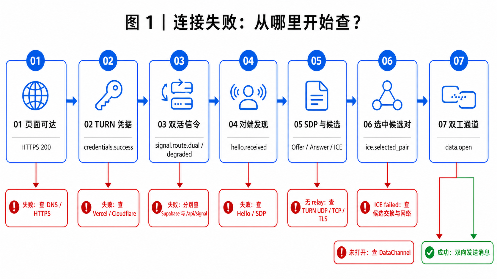
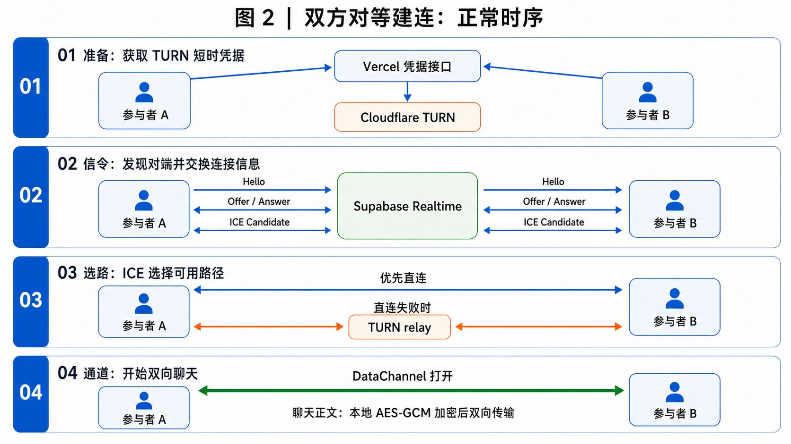
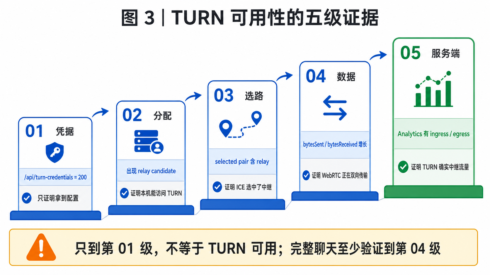

# TwoOnly 常见问题与网络排障 FAQ

这份 FAQ 按故障类型组织，不按问题出现的时间堆笔记。排障目标只有一个：确认连接停在网页、TURN 凭据、Supabase 信令、ICE 选路还是 DataChannel，并让两端拿出能互相印证的日志。

## 0. 先看总流程

| 问题类型 | 典型症状 | 对应章节 |
| --- | --- | --- |
| 页面与凭据 | 页面打不开、凭据超时、接口 502/503 | [1. 页面与 TURN 凭据](#1-页面与-turn-凭据) |
| 主备信令 | `websocket connection failed`、`signal.route.degraded/unavailable` | [2. 主备信令](#2-主备信令) |
| ICE 与 TURN | 没有 relay、`ice.failed`、无法确认是否走中继 | [3. ICE 与 TURN](#3-ice-与-turn) |
| 连接生命周期 | 两端状态不一致、反复自动重连、换网失败 | [4. 连接生命周期与网络差异](#4-连接生命周期与网络差异) |
| 产品与安全边界 | 历史不同步、旧角色链接、第三人进入 | [5. 产品与安全边界](#5-产品与安全边界) |

图 1 的规则很简单：前一层成功，只能证明前一层。例如 `/api/turn-credentials` 返回 200，不能证明当前网络能连接 TURN；收集到 relay candidate，也不能证明 ICE 最终选中了它。

## 1. 页面与 TURN 凭据

### 1.1 页面打不开，先查什么？

先在故障设备上直接打开正式地址，确认 DNS、TLS 和页面资源均成功。不要用自己电脑能打开作为对方网络的证据。

浏览器 Network 中至少应看到：

- HTML 文档返回 200；
- 页面脚本和样式加载完成；
- `/api/turn-credentials` 请求有明确的状态码，而不是一直 pending；
- 没有代理证书错误、DNS 错误或跨域拦截。

页面本身不可达时，WebRTC、Supabase 和 TURN 都还没有开始，继续看 ICE 日志没有意义。

### 1.2 凭据接口返回 200，是否等于 TURN 正常？

不等于。它只证明：

- 当前设备能访问 TwoOnly 的 Vercel Function；
- Vercel 保存的 Cloudflare Key ID 和 API Token 能生成短时配置；
- 浏览器收到了格式有效的 `iceServers`。

真正的 TURN 可用性至少要看到 `relay` candidate。确认聊天确实经过 TURN，则还要看到实际选中的 Candidate Pair 含 `relay`，并且双向字节持续增长。

### 1.3 凭据日志异常时怎么处理？

| 最后事件 | 判断 | 处理 |
| --- | --- | --- |
| `credentials.request.start` 后超过 10 秒没有结果 | 浏览器到 Vercel 请求悬挂 | 在 Network 检查 DNS、TLS、状态和耗时 |
| `credentials.request.timeout` | 客户端已主动中止请求 | 检查 `/api/turn-credentials`；客户端会继续使用静态 ICE 或 STUN-only |
| `credentials.response.http_error`，状态 502 | Vercel 已收到请求，但 Cloudflare 调用或配置失败 | 用 `requestId` 对照 Vercel Function 日志 |
| 状态 503、错误为 `turn_not_configured` | 生产环境缺少 Cloudflare TURN 变量 | 检查 Vercel Production 环境变量并重新部署 |
| `credentials.success` 与 `credentials.ready` | 凭据阶段完成 | 继续检查 `signal.route.*`，不要提前判定 TURN 可用 |

Vercel Route 会在响应头和正文中返回同一个脱敏 `requestId`。服务端日志格式是 `[twoonly:turn][requestId] ...`，可用它把浏览器请求和 Function 日志对应起来。

## 2. 主备信令

图 2 中的参与者 A、B 完全对等。双方都发送 Hello；`participantId` 只用于选出本轮临时 Offer 发起方，不是长期身份，也不是权限角色。图中 Supabase 表示主路径；当前实现还会把同一信令加密后写入 Vercel HTTPS 临时队列，聊天正文不会进入两条信令。

### 2.1 任意一方无法访问 Supabase，会发生什么？

建连前，双方必须通过至少一条共同可达的信令交换 Hello、Offer、Answer 和 ICE Candidate。当前双方同时使用 Supabase Realtime 和同源 `/api/signal`：任意一方无法访问 Supabase 时，只要双方仍能访问 Vercel HTTPS，便可继续建立 PeerConnection。

已经出现 `data.open` 后，聊天正文走 WebRTC DataChannel，HTTPS 轮询会暂停；网络迁移或连接断开后，轮询重新启动并参与新一轮握手。

项目仍不提供 `BroadcastChannel` 本地 fallback。缺少 Supabase 配置时记录 `signal.supabase.config.missing` 并尝试 HTTPS；缺少 Upstash 配置时 `/api/signal` 返回 503 并继续尝试 Supabase。只有两条都不可用才出现 `signal.route.unavailable`。

这里不是单边故障后切换。双方始终双发双收，再按唯一 `signalId` 去重，避免一端留在 Supabase、另一端切到 HTTPS 的“信令分裂”。完整实现见 [Vercel HTTPS 信令降级](signaling-resilience.md)。

### 2.2 `websocket connection failed` 与 `transport failure` 是 TURN 报错吗？

通常不是。Supabase Realtime SDK 会把部分底层 WebSocket 故障归一化为 `transport failure`。如果两条错误前后紧邻，它们一般描述同一次 Supabase 信令 WebSocket 失败。

典型证据是已经出现 `credentials.success` 和 `signal.supabase.subscribe.start`，随后出现 `signal.supabase.transport.error`。如果同时出现 `signal.route.degraded` 和 HTTPS provider 的 `hello.received`，降级已经生效；如果最终是 `signal.route.unavailable`，再检查 `/api/signal` 状态和 Redis 配置。

### 2.3 正常建连应看到哪些关键事件？

| 阶段 | 两端应出现的关键事件 | 成功含义 |
| --- | --- | --- |
| 凭据 | `credentials.success`、`credentials.ready` | ICE 配置解析完成 |
| 信令 | `signal.supabase.ready` 或 `signal.route.degraded`；理想为 `signal.route.dual` | 至少一条共同信令可用 |
| 对端发现 | `hello.sent`、`hello.ack`、`hello.received` | 双方能够通过信令互相发现 |
| 临时选举 | `peer.elected` | 双方锁定同一个 peer 并确定本轮 Offer 发起方 |
| SDP | `sdp.offer.*`、`sdp.answer.*` | Offer/Answer 已交换并应用 |
| ICE | `ice.candidate.*`、`ice.connected` 或 `ice.completed` | 已选出可用网络路径 |
| 通道 | `data.open`、`ice.selected_pair` | 可以双向发送加密消息 |

日志同时写入页面“连接诊断”和浏览器 Console，统一前缀为 `[twoonly][traceId][时间][阶段][事件代码]`。页面保留最近 200 条、展示最近 60 条；重复 Hello/Candidate 会在面板中合并。日志不会持久化，刷新后清空。

### 2.4 Hello、选举或 SDP 停住时怎么判断？

| 现象 | 判断 | 下一步 |
| --- | --- | --- |
| A 有 Supabase/HTTPS send ack，B 没有 `hello.received` | 写入成功但 B 没收到 | 比较双方 `signal.route.*`、room 是否一致，并检查 B 的 HTTPS poll/WSS |
| 双方都有 `hello.received`，没有 `peer.elected` | peer lock 或 epoch 判定未完成 | 查 `hello.busy`、`hello.stale`、`signal.message.stale_epoch` |
| `peer.elected localIsOfferer=true` 后没有 `sdp.offer.created` | 临时发起端创建 Offer 失败 | 查紧随其后的 `sdp.negotiation.failed` |
| Offer/Answer 轮次不一致 | 旧协商污染当前连接 | 比较双方 epoch 与短 negotiation ID，并让双方刷新到同一版本 |
| `signal.protocol.legacy` | 房间里仍有旧协议页面 | 双方全部刷新后重新进入 |

### 2.5 浏览器 Console 与 Vercel Logs 有什么区别？

- 浏览器 Console：记录凭据请求、Supabase、Hello、SDP、ICE、DataChannel 和重连全过程。
- Vercel Runtime Logs：记录 TURN 凭据和 `/api/signal` 发布/失败；看不到浏览器里的 WebRTC 状态和密文内容。
- Supabase Dashboard：用于观察 Realtime 服务状态；它不会替代两端浏览器日志。

复制诊断日志时不要额外粘贴完整邀请链接、fragment secret、安全码、TURN username/credential、Supabase key、完整 SDP、原始 Candidate/IP 或聊天内容。客户端已有脱敏逻辑，不要手工绕过。

## 3. ICE 与 TURN

### 3.1 为什么开了 TURN 仍然可能失败？

常见原因包括：

- 对方能访问凭据接口，却无法解析或连接 TURN 主机；
- UDP 被企业网、校园网、代理或运营商封锁，TCP/TLS 备用地址也不可达；
- 临时用户名或凭据过期、撤销或签发错误；
- 只有一端取得 relay candidate；TURN allocation 本来就由双方各自完成；
- 两端都有 relay，但 Candidate 信令丢失、属于旧协商，或 ICE connectivity check 没选中它；
- allocation 已建立，但 Permission、ChannelBind 或刷新失败；
- 服务容量、临时维护、严重丢包、MTU 或网络拓扑变化导致路径中断；
- WebRTC 已恢复，而 UI 仍保留旧状态；这种情况必须用选中候选对和双向字节复核。

TURN 是穿透兜底，不是连接成功开关。它无法替代 Supabase 信令，也无法保证所有运营商网络都能访问 relay。

### 3.2 如何确定对方机器能够访问 TURN？

参与者 A、B 必须分别在自己的真实网络测试：

1. 打开 [WebRTC Trickle ICE](https://webrtc.github.io/samples/src/content/peerconnection/trickle-ice/)。
2. 从本机 `/api/turn-credentials` 响应临时取出一组 TURN `urls`、`username`、`credential`；不要截图、公开或提交这些短时敏感值。
3. 删除页面默认服务器，只添加一个待测 TURN 地址。
4. 点击 **Gather candidates**；出现 `relay` 才证明这台设备、这个浏览器和当前网络完成了 TURN allocation。
5. 分别测试 UDP、TCP 和 TLS 443，记录每种结果。

Trickle ICE 只证明单机能获得中继候选。完整聊天仍需两端强制 relay、双向发消息，并检查 Candidate Pair。

### 3.3 看到 relay candidate，是否等于聊天正在走 TURN？

不等于。ICE 可以同时收集 `host`、`srflx`、`relay`，最终会选择一对可用路径。出现 relay 只说明 TURN 是候选项；实际选中路径必须从 `RTCPeerConnection.getStats()` 或浏览器 WebRTC 内部页确认。

TwoOnly 的状态文案按实际选中的 Candidate Pair 判断：

- 候选对含 `relay`：显示“TURN 加密中继”；
- 选中直连候选：显示“WebRTC 点对点直连”；
- 浏览器暂未暴露足够统计：显示“WebRTC 已连接”。

### 3.4 怎样判断是哪种 TURN 传输被拦截？

| 单独测试地址 | 用途 | 常见判断 |
| --- | --- | --- |
| `turn:…:3478?transport=udp` | 常规 UDP TURN，通常延迟最低 | 失败而 TLS 成功，多半是 UDP 受限 |
| `turn:…:3478?transport=tcp` | TCP 兜底 | UDP/TCP 都失败时继续测 TLS 443 |
| `turns:…:443?transport=tcp` | TLS 443 兜底 | 严格网络通常更容易放行 |

三种都失败但凭据接口成功，应查 DNS、代理、防火墙、证书拦截、凭据和服务端状态。三种都能产生 relay，而 TwoOnly 强制 relay 仍失败，则转查 Supabase Candidate 交换和 ICE 协商轮次。

### 3.5 在 `chrome://webrtc-internals` 里重点看什么？

- `connectionState` 与 `iceConnectionState`；
- selected/nominated 且 `succeeded` 的 `candidate-pair`；
- 对应 local/remote candidate 的 `candidateType`、`protocol`、`relayProtocol`；
- `bytesSent`、`bytesReceived`、`currentRoundTripTime`；
- ICE Candidate error 与状态变化时间。

两端统计从各自视角记录，本地和远端方向会互换，内部 ID 也不相同。应比较候选类型、协议、时间和双向流量，不要要求两份统计文本逐字一致。

### 3.6 Cloudflare TURN Analytics 能证明什么？

Analytics 的 `concurrentConnections`、`ingressBytes`、`egressBytes` 可以证明测试时间段内 TURN 边缘确实有连接和中继流量，也能帮助发现只有单向字节的异常。

它不知道 TwoOnly 的参与者、临时 Offer 发起方或应用消息，也无法读取 AES-GCM 正文。排障时必须记录准确测试时间，再与两端日志和 Candidate Pair 对照。

## 4. 连接生命周期与网络差异

### 4.1 一端显示 TURN 正常，另一端一直断开，合理吗？

短暂不一致可能来自浏览器状态事件和统计刷新时间差；持续不一致不正常。同一条 ICE Candidate Pair 是双向路径，两端的 local/remote 方向虽相反，但连接状态不应长期一成一败。

项目已经修复过两类误判：瞬时 `disconnected` 现在有 2.5 秒确认期；TURN 文案只根据实际选中的 Candidate Pair，而不是候选池里是否出现过 relay。再次复现时应先确认双方使用同一部署，再比较两端 `data.open`、`ice.selected_pair` 和双向字节。

### 4.2 为什么断网恢复后不能立即重连？

WebRTC 的 `disconnected` 可能只是短暂抖动，立即销毁连接会让双方进入不同协商轮次。TwoOnly 先等待 2.5 秒；原连接恢复便继续使用，持续失败才重新握手。

重新握手依赖 Supabase 或 Vercel HTTPS 至少一条恢复。DataChannel 断开时会重新启动 HTTPS 轮询；只有 `signal.route.unavailable` 时，“立即重连”才无法交换新的 Offer/Answer/ICE。

### 4.3 为什么同一 Wi‑Fi 能聊，换两个网络就失败？

同一局域网可能直接选中 `host` candidate，完全没有验证公网 NAT 穿透或 TURN。跨网络失败时依次确认：

1. 两端至少共享一条可用信令，并出现一致的 `signal.route.*`；
2. 两端各自收集到 `srflx` 或 `relay`；
3. UDP、TCP、TLS 443 至少一种 TURN 传输可用；
4. ICE 真正选中了 Candidate Pair；
5. 双向字节持续增长。

### 4.4 TURN 能保证中国大陆稳定访问吗？

不能。完整会话需要同时访问网页与凭据接口、Supabase Realtime WebSocket、STUN/TURN 节点和最终选中的 WebRTC 路径。Cloudflare TURN 只能提高复杂 NAT 下的成功率，不提供中国大陆网络 SLA。

正式稳定方案需要合规自有域名、境内或邻近区域静态托管、国内可达的信令服务、TCP/TLS 443 TURN，以及电信、联通、移动、教育网和公司网络的持续实测。

## 5. 产品与安全边界

### 5.1 聊天记录为什么没有同步到新设备？

历史以 AES-GCM 密文保存在每台设备的 `localStorage`。它能在同一浏览器刷新后恢复，但不会跨设备同步；双方离线时也没有服务器信箱。

### 5.2 为什么不能公开完整邀请链接？

URL fragment 中包含会话秘密。fragment 通常不会随 HTTP 请求发送给服务器，但拿到完整链接的人仍可能加入会话并推导应用层密钥。应通过可信渠道分享，并在双方页面核对安全码。

### 5.3 旧链接中的 `role=host` / `role=guest` 还有效吗？

不再决定连接行为。v2 新链接统一为 `?room=<id>#<secret>`；旧参数只用于迁移已有本地消息方向。双方都会发送 Hello，再由随机 `participantId` 选出本轮临时 Offer 发起方。

旧 URL 可解析不代表 v1/v2 信令互通。出现 `signal.protocol.legacy` 时，应让双方全部刷新到最新部署。

### 5.4 第三个人为什么有时刷新后还能尝试进入？

“只允许两个人”当前由两端页面的运行时 peer lock 实现，不是服务端账号席位。DataChannel 已打开时，第三个页面会收到 `room-full`；只有旧 peer 已失败、关闭或长时间失联时，新页面才可能接替。

如果三个页面几乎同时首次进入，可能因为消息到达顺序不同而先锁到不同对象。严格的双人身份需要服务端原子成员槽、一次性邀请核销、成员公钥与签名握手。

## 6. 标准化取证与验收

### 6.1 报障时最少提供什么？

两端分别提供以下信息，缺一端只能得到猜测：

1. 精确测试时间、浏览器版本、设备与网络类型；
2. 页面“复制日志”得到的脱敏日志；
3. `/api/turn-credentials` 的状态码、耗时和 `requestId`，不要提供 credential；
4. 是否出现 `signal.route.dual/degraded`、`hello.received`、`data.open`；
5. selected Candidate Pair 的 candidate type、protocol 和双向字节；
6. 如强制 relay，Cloudflare Analytics 对应时间段的 ingress/egress。

### 6.2 一份够用的验收清单

- [ ] 参与者 A、B 使用两台真实设备和两个不同网络，打开同一条无角色邀请链接。
- [ ] 双方都有 `signal.route.dual/degraded`、`hello.sent`、`hello.received` 和一致的 `peer.elected`。
- [ ] 阻断 Supabase 后，双方仍能通过 HTTPS provider 完成新房间握手。
- [ ] Offer/Answer 使用同一轮双方 epoch 与 negotiation ID。
- [ ] 第三个页面收到 `rejected(room-full)`，已有会话保持稳定。
- [ ] 两端凭据接口都成功，且各自通过 Trickle ICE 得到 relay candidate。
- [ ] UDP、TCP、TLS 443 分别测试并记录结果。
- [ ] 临时强制 `relay` 后，两端均出现 `data.open`。
- [ ] 双方各发送文字和一张小图片，双向均成功。
- [ ] selected Candidate Pair 含 relay，`bytesSent` 与 `bytesReceived` 均增长。
- [ ] Cloudflare Analytics 同期出现连接与双向流量。
- [ ] 断网恢复后双方能重新握手。
- [ ] 测试结束后把 `NEXT_PUBLIC_ICE_TRANSPORT_POLICY` 恢复为 `all` 并重新部署。

## 7. 继续阅读

- [TURN 配置手册](turn-configuration.md)
- [WebRTC、双工通道与加密](webrtc-security.md)
- [Supabase、Vercel 与部署运维](deployment-operations.md)
- [Supabase 不可达时的信令容灾方案](signaling-resilience.md)
- [TwoOnly 项目复盘](project-retrospective.md)
- [Cloudflare TURN 短时凭据](https://developers.cloudflare.com/realtime/turn/generate-credentials/)
- [Cloudflare TURN Analytics](https://developers.cloudflare.com/realtime/turn/analytics/)
- [Cloudflare TURN FAQ](https://developers.cloudflare.com/realtime/turn/faq/)
- [MDN RTCIceCandidatePairStats](https://developer.mozilla.org/en-US/docs/Web/API/RTCIceCandidatePairStats)
- [TURN 协议 RFC 8656](https://www.rfc-editor.org/rfc/rfc8656.html)
