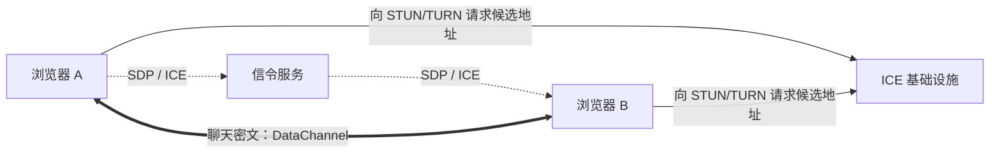
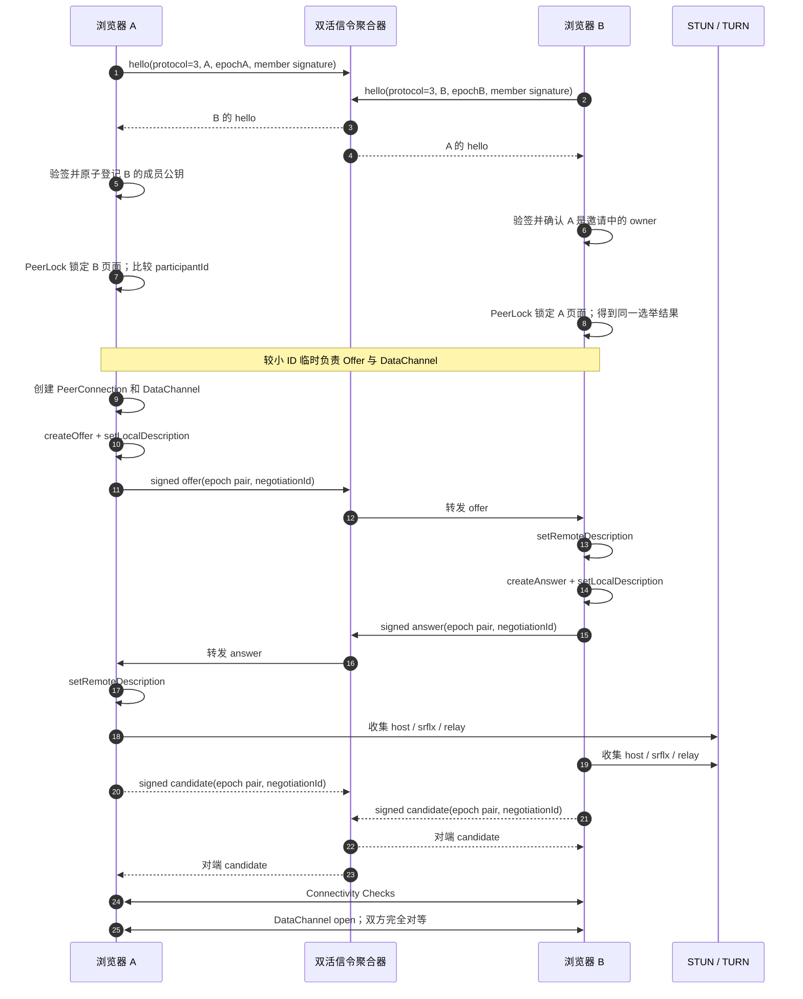
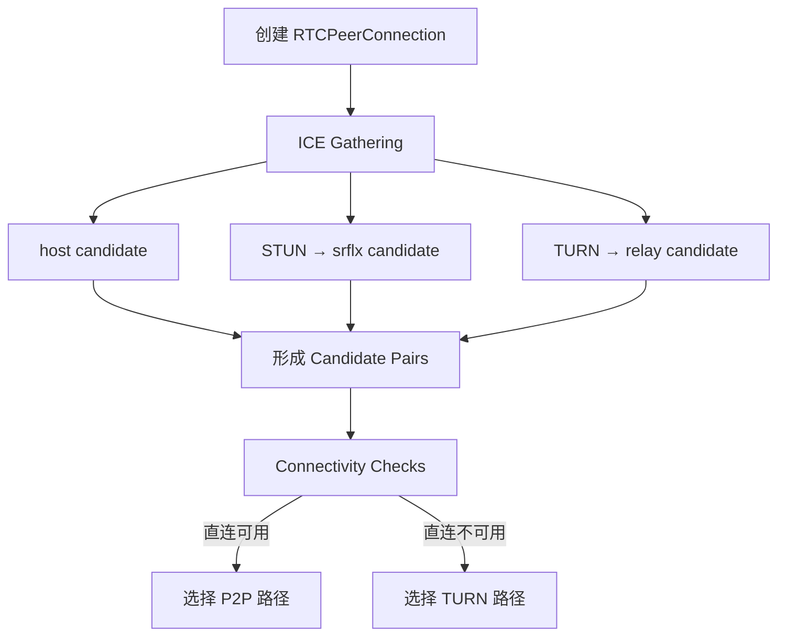
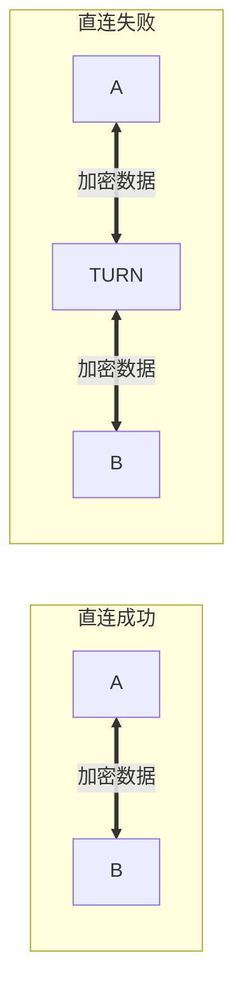
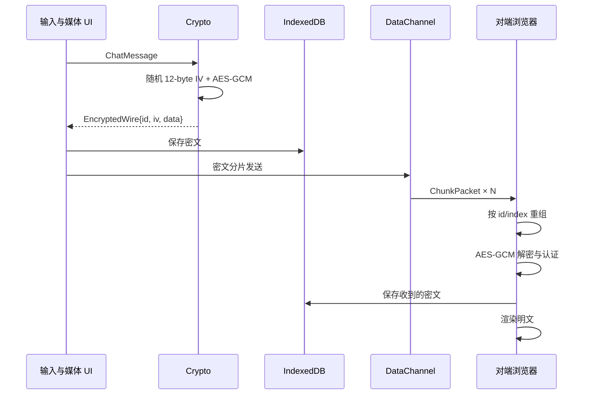
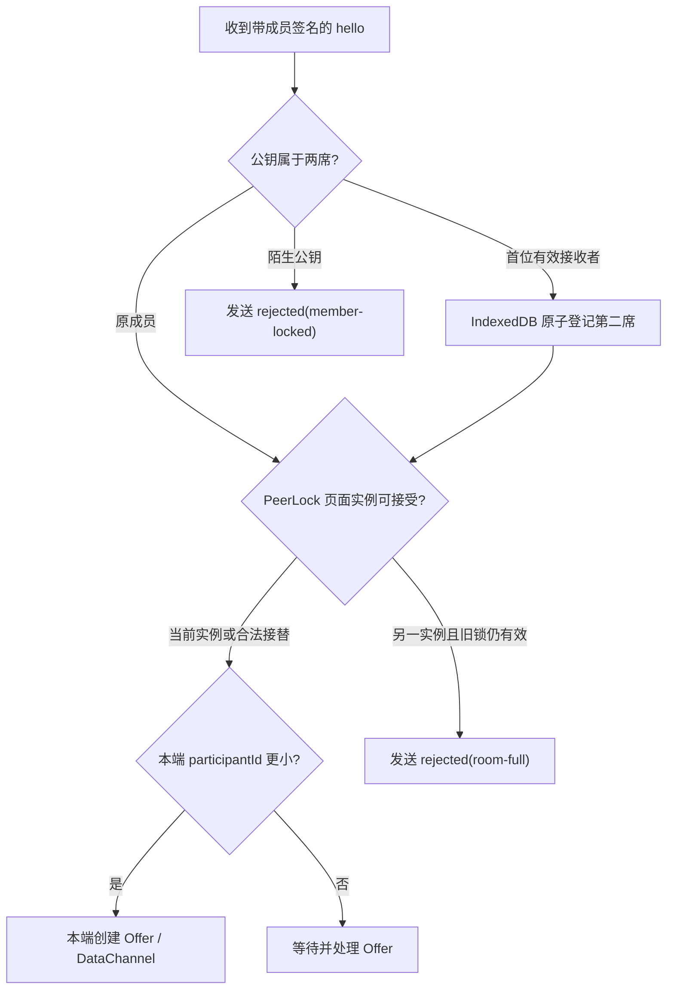
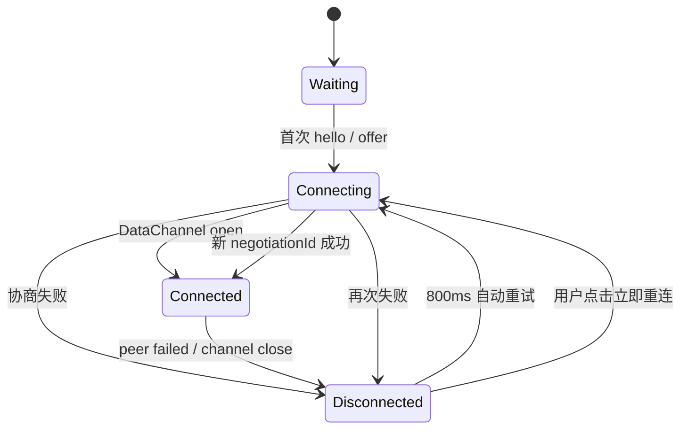

# 从一条邀请链接到一条加密 P2P 通道

这不是一篇“把 API 名字背一遍”的 WebRTC 教程，而是 TwoOnly 做完以后，我觉得最值得留下的一套心智模型。

项目表面上很简单：两个人打开网页，复制一个链接，然后聊天。真正落到网络上，却会依次碰到身份、信令、NAT、ICE、TURN、加密、本地持久化和断线恢复。把这些环节拆开以后，WebRTC 就不再神秘了。

## 先看完成后的全貌


> 这张总览图由 OpenAI ImageGen 生成，用来快速建立空间感。后文的 Mermaid 图以协议和源码为准。

TwoOnly 运行时有六类参与组件：

| 组件 | 做什么 | 不做什么 |
| --- | --- | --- |
| 浏览器 A / B | UI、加解密、WebRTC、本地历史 | 不把聊天正文交给业务服务器 |
| Vercel | 发网页、运行 TURN 凭据接口和同源 HTTPS 信令 | 不保存聊天正文 |
| Supabase Realtime | 通过 WebSocket 交换 `hello / offer / answer / candidate` | 不转发聊天正文 |
| Redis Stream | 暂存 AES-GCM 密文信令，180 秒过期 | 不知道 fragment 密钥，不保存聊天正文 |
| STUN | 告诉浏览器公网侧看到的地址 | 不转发聊天内容 |
| TURN | 直连不通时中继 WebRTC 数据 | 不负责房间和消息历史 |
| IndexedDB | 在当前设备保存房间凭证和 AES-GCM 密文 | 不做多设备同步 |

最重要的一句话是：

> P2P 不是“完全没有服务器”，而是“业务数据尽量不经过你的业务服务器”。

网页要有地方下载，两个陌生浏览器要有地方交换联系方式，复杂 NAT 下还要有人帮忙中继。服务器没有消失，只是职责被拆开了。

## 一条连接其实有三条逻辑链路

很多第一次做 WebRTC 的问题，都来自把下面三条链路混在了一起。



第一条是**信令链路**：让两端交换 SDP 和 ICE Candidate。WebRTC 规范故意没有规定信令必须怎么做，所以 WebSocket、Socket.IO、Supabase Broadcast、HTTP 轮询都可以。TwoOnly 同时使用 Supabase WebSocket 与 Vercel 同源 HTTPS + Redis Stream；双方双发双收，避免单边切换后落进两个不同信令网络。

第二条是**路径发现链路**：ICE 调用 STUN/TURN，收集和测试候选路径。信令服务器不会替浏览器“打洞”。

第三条是**数据链路**：连接建立后，文字、图片和语音的密文走 `RTCDataChannel`。直连成功时是浏览器到浏览器；直连失败时是浏览器到 TURN 再到浏览器。

WebRTC 官方入门也把信令定义为应用自己提供的异步交换通道，并建议使用 Trickle ICE 边收集边发送 Candidate，以缩短建连时间：[Peer connections](https://webrtc.org/getting-started/peer-connections)。

## 信令：先让两位房间成员互相介绍

TwoOnly v3 不给用户分配长期房主/访客权限，但会为每个房间保存两把 P-256 成员公钥。每次页面加载仍生成随机 `participantId`；双方订阅信令后广播带成员签名的 Hello，先完成持久成员准入，再用同一条确定性规则选出本轮临时 Offer 发起方。完整顺序如下：



这里有几个很实战的细节：

- `setLocalDescription()` 和 `setRemoteDescription()` 的顺序不能乱；
- Candidate 可能比远端 SDP 更早到，所以 TwoOnly 会按参与者、双方 epoch 与 `negotiationId` 放进对应的 `pendingIce` 分桶；
- 每次协商带一个新的 `negotiationId`，本端每次重连递增 local epoch，因此旧 Answer 和旧 Candidate 不会污染新连接；
- v3 信令携带明确的协议版本和每房间 P-256 ECDSA 签名；签名同时绑定 Room ID、Room Secret 与稳定信令内容，只知道公开 Room ID 的人不能抢占成员席位；
- 创建端用一个 IndexedDB 读写事务登记首个有效接收者，此后陌生公钥在进入 PeerLock 和 SDP 协商前就会被拒绝；
- `participantId` 较小的一端只是本轮临时 Offer 发起方，不拥有更多权限；
- 所有信令串进同一条 Promise 队列，避免两个异步分支同时修改 `signalingState`；
- 重复 Offer 不一定是错误，网络重试时可以重发已经生成的 Answer。

这些保护都集中在 `src/webrtc/WebRtcSession.ts`；`src/signal/signalTransport.ts` 负责 Supabase/HTTPS 双发与 `signalId` 去重，各 provider 只负责自己的收发和健康状态，不参与 PeerConnection 状态机。

## ICE、STUN 和 TURN：谁才是在“打洞”

### 先理解 Candidate

浏览器可能收集到三类常见候选地址：

| 类型 | 可以怎么理解 | 典型来源 |
| --- | --- | --- |
| `host` | 我在本机或局域网里的地址 | 网卡 |
| `srflx` | NAT 外面的人看到的我 | STUN |
| `relay` | TURN 为我分配的中继地址 | TURN |

ICE 不是简单地“先 STUN，失败后再 TURN”这一条串行 `if/else`。它会形成候选对，执行 Connectivity Check，再选出可用且优先级合适的路径。ICE、STUN、TURN 的标准分别可追到 [RFC 8445](https://www.rfc-editor.org/info/rfc8445/)、[RFC 8489](https://www.rfc-editor.org/info/rfc8489/) 和 [RFC 8656](https://www.rfc-editor.org/info/rfc8656/)。



### “打洞”没有名字听起来那么玄学

两端都主动向对方的公网映射地址发包，NAT 因为看到了内部设备主动发起的流量，临时允许对应的返回流量进入。这个映射会过期，也可能因为对称 NAT、CGNAT、企业防火墙、校园网或 UDP 禁用而根本不可复用。

所以 STUN 的作用更像“照镜子”，TURN 的作用更像“快递中转站”：



TURN 会消耗真实带宽，因此通常是兜底而不是默认路径。TwoOnly 默认使用 `iceTransportPolicy: "all"`，让浏览器优先挑选合适路径；只有联调时才会把策略临时改成 `relay`，强制证明 TURN 真能工作。

## DataChannel：这条双工通道是怎么来的

选举出的临时 Offer 发起方创建一个可靠、按序的 `RTCDataChannel`，另一端从 `ondatachannel` 事件接到同一条逻辑通道。通道一旦 `open`，这个临时差异就结束了：双方都能 `send()`，也都能收到 `message`，因此它是全双工而不是请求—响应。

底层可以粗略理解为：

```text
应用消息
  ↓
RTCDataChannel
  ↓
SCTP
  ↓
DTLS
  ↓
ICE 选中的 UDP/TCP/TURN 路径
```

WebRTC DataChannel 自带 DTLS 加密；MDN 也明确说明所有 DataChannel 数据必须受到 DTLS 保护：[Using WebRTC data channels](https://developer.mozilla.org/en-US/docs/Web/API/WebRTC_API/Using_data_channels)。TwoOnly 仍然再做一层 AES-GCM，这是产品安全边界的选择，而不是因为 WebRTC “裸奔”。

DataChannel 不是无限大的管道。常规消息的加密 JSON 会切成 12,000 字符一片；大图片和 Beta 文件先按 192 KB 独立加密，再继续切成 DataChannel 小包。发送缓冲超过高水位后，代码会等待 `bufferedamountlow` 回到低水位，避免把 100 MB 内容一次灌入浏览器队列。

## 一条消息在项目里经历了什么



文字、语音和 1.5 MB 以内附件最后都变成同一种 `ChatMessage`；图片/小文件由 `FileReader` 转成 Data URL，语音由 `MediaRecorder` 录制后转成 Data URL。更大的图片和 Beta 文件使用独立的 `attachment-start / attachment-chunk` 协议，接收完成后生成当前页面有效的 `Blob URL`。这样既保留原有本机历史，也把 100 MB 传输的峰值内存限制在附件本身附近。

### 会话秘密放在哪里

邀请链接长这样：

```text
https://站点/?room=<roomId>#secret=<secret>&owner=<ownerPublicKey>
```

- `roomId` 用来选择 Supabase topic；
- `secret` 和创建者公钥 `owner` 放在 URL Fragment，也就是 `#` 后面。

解析器只读取 `room` 和 fragment 中的 `secret`、`owner`；多余的 `role` 参数不会进入当前状态。`owner` 是首次准入的信任锚，不是聊天 UI 里的长期权限角色。没有本机旧房间记录的新浏览器会拒绝缺少 `owner` 的旧式链接，避免后来者复用一个已经存在过的房间。

Fragment 不会作为 HTTP 请求的一部分发给 Vercel。浏览器取到 `secret` 后计算 SHA-256，再把结果导入为不可导出的 AES-GCM 密钥。之所以可以直接哈希，是因为这里的 secret 本身是约 256 位随机值；如果换成用户口令，就必须使用专门的口令派生算法，而不能照搬。

每条消息都有独立随机 IV。AES-GCM 同时做保密和完整性认证：密文或 IV 被修改时，解密会失败，而不是吐出一段悄悄被篡改的明文。

## “只允许两个人”到底保证到了哪一层

TwoOnly 的双人限制现在分成持久成员和临时页面两层：

1. 创建房间时生成创建者的房间专属 P-256 密钥，并把公钥放入邀请 Fragment；
2. 第二个浏览器生成自己的房间专属密钥，用同时绑定 Room Secret 的签名证明自己拿到了完整邀请；
3. 创建端用 IndexedDB 单个读写事务把首个有效接收者公钥写入第二席位；
4. 两席确认后，所有 Hello、Offer、Answer、Candidate 和 Rejected 都必须由原成员私钥签名，陌生公钥收到 `rejected(member-locked)`；
5. 页面级 `participantId`、epoch 与 PeerLock 只负责原成员的标签页实例和重连轮次。旧页面超时后同一成员的新页面可以接替，但席位不会换成一把新公钥。



成员席位保存在双方 IndexedDB，而不是服务器账号系统。页面全部关闭、锁屏、断线或 PeerLock 超时都不会把席位转让给后来者；只有持有原房间私钥的浏览器能重新进入。代价同样明确：清理站点数据、删除房间或换设备会丢失本机私钥，旧邀请不能找回已锁定席位。本项目不读取 MAC、deviceId 或浏览器指纹，也没有跨设备身份恢复。第二席位首次确认前，完整邀请泄露者仍可能抢先占位；若要消除这个窗口，需要服务端一次性邀请核销。

## 断线重连：项目里最容易被低估的一段

第一次握手成功只算完成了一半。移动网络切换、电脑休眠、标签页后台节流和已选 ICE 路径失效都可能把连接撕开。Supabase WebSocket 单独中断不会关闭已经打开的 DataChannel；它影响的是下一轮握手，且同源 HTTPS 仍可接替信令。

TwoOnly 的恢复策略是：



几个经验比“加一个 reconnect 按钮”更重要：

- 不要让旧 PeerConnection 的异步回调改写新会话状态；
- 重连必须递增 local epoch，并为新协商生成 `negotiationId`；
- 双方恢复 `hello`，重新执行确定性选举；被选中的一端创建带 `iceRestart` 的 Offer；
- 信令短暂掉线但 DataChannel 还活着时，不要误报聊天已断开；
- 自动重试和手动重试必须复用同一个状态机。

## 历史记录为什么只保存在本地

用户提出“不要一次性，聊天记录保留一下”以后，我们选择了一个边界很清楚的方案：每台设备最多保存 200 条 `EncryptedWire`，刷新时使用邀请链接里的 secret 本地解密。

消息作者使用当前设备视角的 `self / peer`。这个方向随密文记录一起写进 IndexedDB，刷新或重新打开浏览器后直接恢复，不依赖标签页状态或 URL 角色。

优点是服务端没有聊天数据库，隐私模型简单；代价也同样明确：

- 换设备不会同步；
- 清浏览器数据就没了；
- 丢掉完整邀请链接就没有密钥；
- 对方离线时没有服务器信箱，发送方本地保存不等于稍后自动送达。

这不是“少做了一个同步功能”，而是产品模型的选择。要加入离线消息，架构会从纯实时 P2P 变成“客户端加密 + 服务器密文信箱”，需要重新设计确认、重放、删除和多设备密钥管理。

## 怎么判断连接到底走了哪里

只看到 DataChannel `open` 还不够。项目会调用 `RTCPeerConnection.getStats()`，找到 transport 实际选中的 Candidate Pair，再检查这条路径是否包含 `relay`：

- 选中的路径包含 `relay`：UI 显示“TURN 加密中继”；
- 选中的是非 relay 路径：显示“WebRTC 点对点直连”；
- 浏览器暂时没有暴露可判定的选中候选对：显示“WebRTC 已连接”。

更深入排查时，可以结合浏览器的 `chrome://webrtc-internals`：

1. 看 Candidate Pair 的 local/remote candidate type；
2. 看当前 nominated / selected pair；
3. 看 bytesSent、bytesReceived 是否增长；
4. 强制 `iceTransportPolicy: "relay"`，验证 TURN 而不是“猜测 TURN 应该没问题”；
5. 同时检查 Supabase Realtime、Vercel `/api/signal` 和 TURN 服务端日志。

## 到这里，可以把整件事记成一句话

> Supabase 与同源 HTTPS 帮两个人交换地图，ICE 尝试找路，STUN 告诉双方自己在公网的样子，TURN 在无路可走时当中转站，DataChannel 负责双工运输，AES-GCM 让货物在装车前就已经上锁。

这套模型既能解释 TwoOnly，也能解释大多数一对一 WebRTC 应用。

## 延伸阅读

- [WebRTC Peer Connections](https://webrtc.org/getting-started/peer-connections)
- [WebRTC Data Channels](https://webrtc.org/getting-started/data-channels)
- [MDN：WebRTC protocols](https://developer.mozilla.org/en-US/docs/Web/API/WebRTC_API/Protocols)
- [MDN：Using WebRTC data channels](https://developer.mozilla.org/en-US/docs/Web/API/WebRTC_API/Using_data_channels)
- [W3C WebRTC](https://www.w3.org/TR/webrtc/)
- [W3C Web Crypto API](https://www.w3.org/TR/WebCryptoAPI/)
- [RFC 8445：ICE](https://www.rfc-editor.org/info/rfc8445/)
- [RFC 8489：STUN](https://www.rfc-editor.org/info/rfc8489/)
- [RFC 8656：TURN](https://www.rfc-editor.org/info/rfc8656/)
