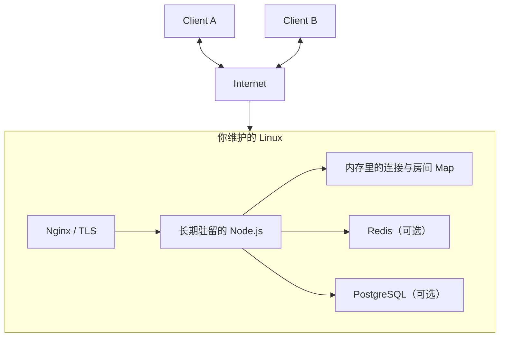
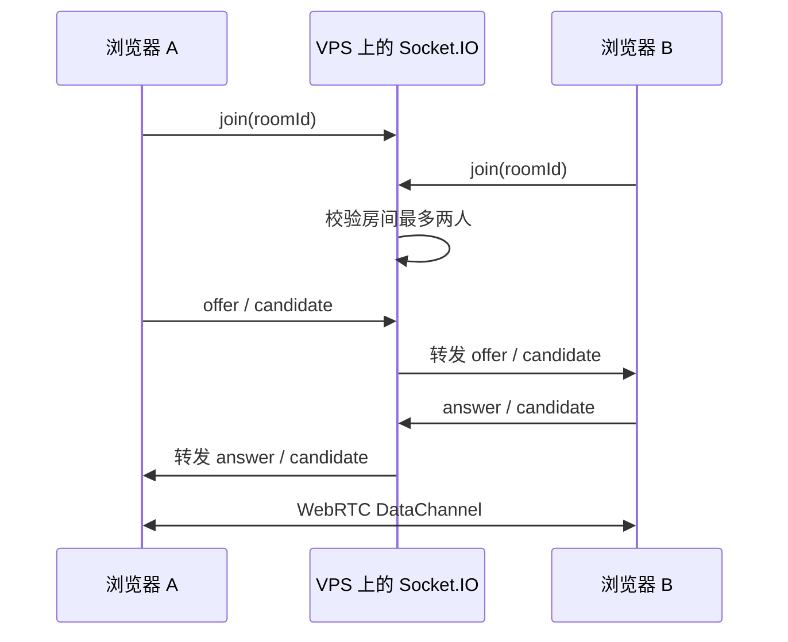
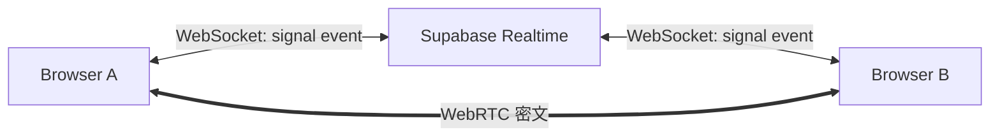
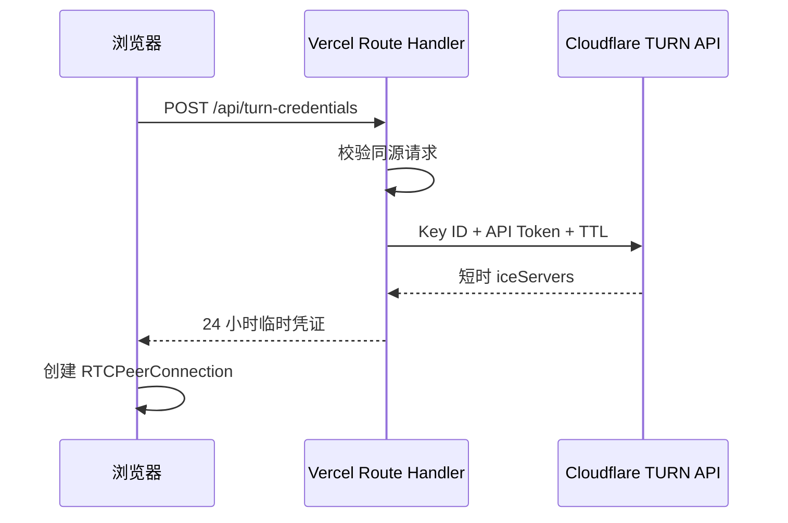
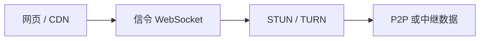
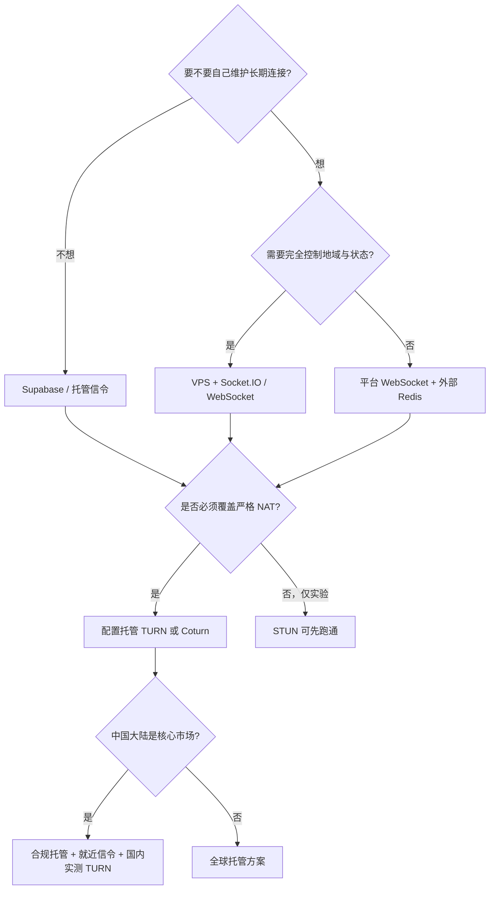

# VPS、Socket.IO、Vercel 和 TURN：到底该把什么放在哪里

做完 TwoOnly 以后，一个很自然的问题是：为什么不直接买一台 VPS，跑一个 Node.js + Socket.IO？答案不是“哪种技术更先进”，而是你想自己持有什么状态。

## VPS 最好用的心智模型

传统 VPS 可以直接理解成一台 24 小时联网、你能 SSH 登录的远程 Linux 电脑。



`node signaling-server.js` 启动以后，进程、内存 Map 和 WebSocket 连接可以一直存在；PM2 或 systemd 负责崩溃拉起，Nginx 负责反代和证书。它非常适合学习长期网络服务，因为系统边界就在眼前。

代价是操作系统更新、端口、防火墙、证书、监控、日志轮转、进程守护和扩容都归你管。

## Vercel 是平台，不是一台你 SSH 进去的电脑

Vercel 更像“把应用交给平台”：Git 提交触发构建，静态资源进入 CDN，需要服务端逻辑时按请求调用 Function。

截至 2026 年，Vercel Functions 已经提供 WebSocket 能力，但连接会绑定到某个 Function，并受该 Function 最大运行时长约束；未来连接也不保证落到同一个实例，持久状态仍应放到 Redis 等外部系统。它仍然不是传统 VPS 那种“我守着一个永久 Node 进程”的模型。参见 [Vercel Functions](https://vercel.com/docs/functions) 和 [WebSocket support](https://vercel.com/kb/guide/do-vercel-serverless-functions-support-websocket-connections)。

| 问题 | VPS | Vercel |
| --- | --- | --- |
| 你拿到什么 | 一台虚拟机 | 应用运行平台 |
| SSH / root | 通常有 | 通常不这样使用 |
| 常驻进程 | 很自然 | 受 Function 生命周期约束 |
| WebSocket 内存状态 | 单机上直观 | 需要考虑实例和外部状态 |
| HTTPS / CDN | 自己配置 | 平台自动化 |
| 扩缩容 | 自己做 | 平台做很多 |
| 系统维护 | 你负责 | 平台负责 |
| 最适合 | 长连接服务、完全控制 | Web 前端、按请求后端、快速发布 |

TwoOnly 把两者的优点拆开用：页面和短请求交给 Vercel，长期信令 WebSocket 交给 Supabase，聊天数据交给浏览器之间的 WebRTC。

## Socket.IO 是什么，又不是什么

Socket.IO 是客户端和服务器之间的低延迟、双向、事件式通信库。它可以使用 HTTP long-polling、WebSocket 或 WebTransport，并提供心跳、自动重连、事件确认、房间和断线恢复。官方文档也特别强调：Socket.IO 不是原生 WebSocket 协议，普通 WebSocket 客户端不能直接连 Socket.IO Server。[Socket.IO Introduction](https://socket.io/docs/v4/) / [How it works](https://socket.io/docs/v4/how-it-works/)

如果 TwoOnly 使用 VPS + Socket.IO，链路会是：



Socket.IO Room 是服务端概念，很适合把一个 roomId 下的事件只发给指定连接：[Rooms](https://socket.io/docs/v4/rooms/)。它还有连接状态恢复机制，但“客户端自动重连”不等于“WebRTC 自动重新协商”，Offer/Answer、ICE Restart 和过期消息过滤仍然要由业务状态机完成：[Connection state recovery](https://socket.io/docs/v4/connection-state-recovery)。

### Socket.IO 能替代什么

它可以替代 TwoOnly 当前的 Supabase Realtime 信令适配器：

```text
Supabase Broadcast
        ↓ 替换
VPS + Socket.IO Room
```

### Socket.IO 不能替代什么

它不会自动替代：

- ICE 的路径选择；
- STUN 的公网映射发现；
- TURN 的流量中继；
- WebRTC DataChannel；
- 应用层 AES-GCM；
- 严格的设备身份认证。

也就是说，Socket.IO 是“介绍人”，不是“打洞器”。当然，你也可以放弃 P2P，让所有聊天都经 Socket.IO Server 转发，但那已经是另一种客户端—服务器架构。

## 为什么当前项目选 Supabase 做信令

Supabase Realtime Broadcast 通过 WebSocket 在客户端之间转发低延迟事件；客户端订阅完成后再发送，消息走已建立的 WebSocket。`ack: true` 可以确认 Realtime 服务已经收到广播。官方说明见 [Supabase Realtime Broadcast](https://supabase.com/docs/guides/realtime/broadcast)。



它让 MVP 不必维护 VPS、证书和 Socket.IO 进程。代价是：

- 公共 topic 不是严格授权；
- 服务区域和跨境网络会影响信令；
- 连接状态由第三方服务托管；
- 做复杂成员系统时，迟早要加 Auth、私有频道或自建信令。

项目没有用 Supabase Database、Storage 或 Auth 保存聊天正文。Supabase 看到的是 topic、SDP、ICE Candidate 等元数据，而不是 AES-GCM 聊天内容。

## TURN 为什么单独放在 Vercel Function 后面

Cloudflare TURN Key 是长期秘密，不能打进 `NEXT_PUBLIC_*` 或浏览器包。正确流程是：



Cloudflare 明确建议长期 TURN Key 留在服务端，为每个客户端签发短期凭证：[Generate Credentials](https://developers.cloudflare.com/realtime/turn/generate-credentials/)。TwoOnly 当前 TTL 为 86,400 秒；接口 `Cache-Control: no-store`，上游请求有 8 秒超时，返回结果还会校验必须包含带用户名和密码的 TURN URL。

生产部署踩过一个很典型的坑：把环境变量临时传给一次部署，不代表它已经持久化到项目的 Production Environment。第一次线上接口因此返回 `turn_not_configured` 503；把变量正式保存到项目后重新部署，接口才稳定返回 200。

另一个坑是代理后的 Origin：Vercel 前面有转发层，只拿应用内部 URL 比较 `Origin` 会误判成跨站请求。最终实现使用 `x-forwarded-host`、`host` 和 `x-forwarded-proto` 重建公开 Origin，并拒绝明确的 cross-site 请求。

## Cloudflare TURN、自建 Coturn，还是都要

| 方案 | 优点 | 代价 | 适合 |
| --- | --- | --- | --- |
| Cloudflare TURN | 接入快、全球节点、短时凭证 API | 按流量、服务不在中国网络 | 海外和快速生产验证 |
| VPS + Coturn | 完全控制、位置可选 | 运维、证书、端口、带宽和攻击面 | 国内优化、可控网络 |
| 多家 TURN | 可做地域和故障切换 | 成本与监控复杂 | 对成功率要求高的产品 |

Cloudflare 当前说明 Realtime TURN 不运行在 Cloudflare China Network；中国流量会连接中国大陆以外的节点。官方 FAQ 同时给出免费额度、按下行流量计费和地域说明，具体价格可能变化，部署前应查最新页面：[Cloudflare TURN FAQ](https://developers.cloudflare.com/realtime/turn/faq/)。

自建 Coturn 至少要准备：

- 独立公网 IP 和 DNS；
- UDP/TCP 3478；
- `turns:` TLS 443 或 5349；
- 一段明确开放的 relay 端口范围；
- 短时 HMAC 凭证，而不是把永久密码写进前端；
- 带宽、allocation、失败码和异常流量监控。

完整命令和配置查 [TURN 配置手册](turn-configuration.md)，这里不再堆一屏配置文件。

## 中国大陆稳定访问不是“加一个 TURN”就结束

一次聊天成功，需要四段都能到：



TURN 只改善最后两段的穿透，解决不了 `vercel.app`、DNS 或跨境链路本身不可达。当前同源 HTTPS 降级可以绕过客户端到 Supabase WebSocket 的故障，但不能绕过 Vercel 自身不可达。

如果国内稳定性是正式目标，更现实的路径是：

1. 自有域名和合规备案；
2. 大陆可达的静态托管/CDN；
3. 大陆或邻近区域的信令服务；
4. 面向电信、联通、移动实测的 TURN；
5. UDP、TCP、TLS 443 三种路径；
6. 真机、真运营商、长期成功率监控。

香港或新加坡部署通常是一个过渡方案，但“延迟比美国低”不等于“大陆稳定性有保证”。

## 选择方案时，可以直接问这五个问题



TwoOnly 当前的答案是：不自建长期连接、使用托管信令、必须有 TURN 兜底、国内访问暂时不做稳定性承诺。

## 延伸阅读

- [Socket.IO Introduction](https://socket.io/docs/v4/)
- [Socket.IO How it works](https://socket.io/docs/v4/how-it-works/)
- [Socket.IO Rooms](https://socket.io/docs/v4/rooms/)
- [Socket.IO Connection state recovery](https://socket.io/docs/v4/connection-state-recovery)
- [Supabase Realtime Broadcast](https://supabase.com/docs/guides/realtime/broadcast)
- [Vercel Functions](https://vercel.com/docs/functions)
- [Vercel WebSocket support](https://vercel.com/kb/guide/do-vercel-serverless-functions-support-websocket-connections)
- [Cloudflare TURN credentials](https://developers.cloudflare.com/realtime/turn/generate-credentials/)
- [Cloudflare TURN FAQ](https://developers.cloudflare.com/realtime/turn/faq/)
