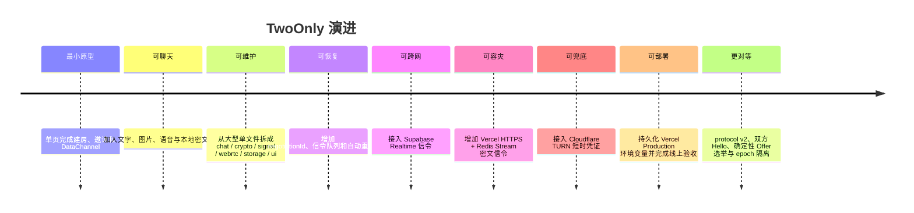
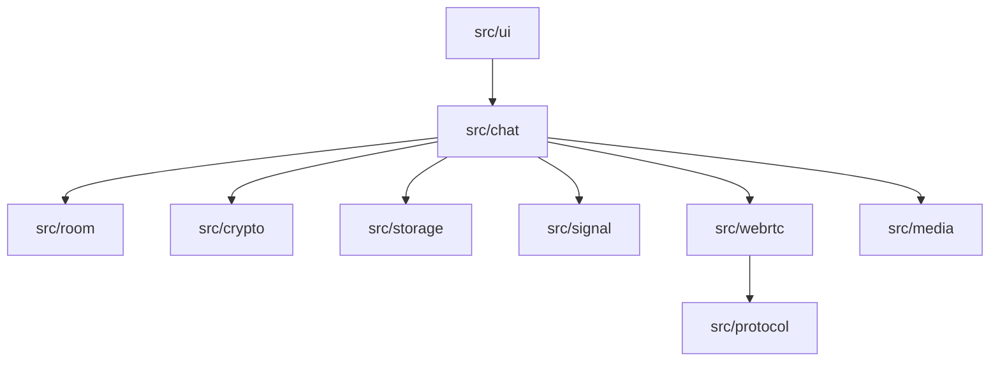
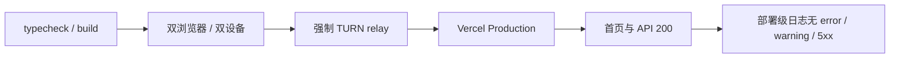

# TwoOnly 项目复盘：真正费时间的不是聊天框

这个项目从一个很小的想法开始：做一个可以快速部署、只允许两个人使用的 P2P 加密聊天，支持文字、图片、语音，还能在本机保留一点历史。

回头看，UI 和消息列表反而不是最难的部分。真正决定“能不能用”的，是信令能否恢复、TURN 是否真的走通、密钥是否留在正确边界，以及部署环境是否和本地一致。

## 最终交付是什么

当前生产地址：<https://twoonly-chat.vercel.app>

| 能力 | 最终状态 |
| --- | --- |
| 双人房间 | v2 无固定角色，双方互锁另一位参与者并拒绝第三页 |
| 文字 / 图片 / 语音 / 文件 | 图片最大 100 MB；文件传输标记 Beta；大附件使用分块加密和 DataChannel 背压 |
| 实时链路 | WebRTC DataChannel |
| 信令 | Supabase Realtime + 同源 Vercel HTTPS 双路信令 |
| NAT 穿透 | STUN + Cloudflare TURN 兜底 |
| 应用加密 | AES-GCM，每条消息独立 IV |
| 本地历史 | 每设备、每房间最多 200 条密文 |
| 断线恢复 | 自动重新握手 + 手动“立即重连” |
| 部署 | Next.js on Vercel，TURN Key 仅在服务端 |

## 项目是怎么一步步变得“可用”的



### 第一阶段：能连上，不等于架构成立

最初所有逻辑放在一个大组件里，创建房间、加密、Supabase、PeerConnection、UI 和录音互相引用。它确实能快速验证想法，但任何连接状态变化都会穿过整份文件。

模块化重构以后，边界变成：



最大的收益不是文件变短，而是可以准确说出：

- Signal 只传信令，不懂聊天正文；
- WebRTC 只传密文，不持有 AES 密钥；
- Storage 只存密文，不自行解密；
- UI 只调控制器，不直接操作 Supabase 和 PeerConnection。

当前基线见 [代码规模与复杂度](code-metrics.md)。复杂度主要集中在信令输入校验、HTTPS 轮询和 WebRTC 协商状态机；这些边界应继续按状态与职责清理，而不是单纯压缩行数。

## 这次遇到的几个真实问题

### 1. 本地模拟能用，外部用户不能用

早期实现曾为同浏览器双标签页保留 `BroadcastChannel` 信令。它绕开 Supabase，导致本地成功无法证明 Realtime WebSocket 或跨设备网络成立。这个伪 fallback 后来被完整删除。项目先统一使用 Supabase，随后增加真正可跨设备的同源 Vercel HTTPS 路径：浏览器从启动起把同一条信令双发到 Supabase 和 `/api/signal`，后者只把 AES-GCM 密文短暂写入 Redis Stream。

跨设备需要至少三件事同时正确：

1. Supabase Realtime 或 Vercel HTTPS 至少一条信令链路可用；
2. 两端确实收到彼此的 Hello、Offer/Answer 和 ICE Candidate；
3. ICE 最终选出可用 Candidate Pair 并打开 DataChannel。

这次经验很直接：**本地页面能跑不是跨网络 E2E。**以后验收必须明确区分静态检查、双浏览器、不同设备、不同网络和生产环境。

### 2. 信令恢复了，双方却不会重新握手（v1 固定角色协议）

WebSocket 自动重连只会恢复“联系渠道”，不会自动重建已经失败的 PeerConnection。最初缺少一套完整的重协商协议，导致断开后双方都在等对方先动。

当时 v1 仍采用固定房主/访客角色，最终修复包含：

- 访客恢复周期性 `hello`；
- 房主针对同一 senderId 重新生成 Offer；
- `createOffer({ iceRestart: true })`；
- 新协商生成新 `negotiationId`；
- 旧 Candidate 和旧 Answer 被过滤；
- 800 ms 自动重试和手动重连共用同一入口。

这件事说明：**重连不是某个按钮，而是一套双端一致的状态机。**

### 3. 配了 STUN，严格网络还是失败

STUN 只能帮忙发现映射，并不能保证 NAT 允许对端使用这个映射。没有 TURN 时，对称 NAT、企业防火墙和 UDP 受限网络仍然会失败。

项目后来增加 `/api/turn-credentials`，由 Vercel 服务端用 Cloudflare 长期 Token 生成短时凭证。浏览器拿到的是临时 `iceServers`，长期 Token 不进入前端包。

验证时不能只看“接口返回成功”。完整证据必须继续检查 relay candidate、实际选中的 Candidate Pair、双向字节和服务端流量。当前最终浏览器回归环境出现过 TURN 701 超时，因此这里只确认凭据服务已经配置，不把它写成“所有网络的 relay 已验证”。

### 4. 本地接口正常，线上却返回 403

Route Handler 最初用请求 URL 的内部 Origin 和浏览器 `Origin` 直接比较。在 Vercel 代理链路里，内部 host/protocol 与公开域名可能不同，于是同源请求被误杀。

修复方式不是关闭校验，而是根据 `x-forwarded-host`、`host`、`x-forwarded-proto` 重建公开 Origin，同时拒绝明确的 `cross-site` 请求。

这类问题的教训是：**部署平台上的请求经过代理，安全校验必须理解代理头，但也不能盲目信任任意客户端伪造的拓扑。**当前实现适合 Vercel 受控代理链路；若迁移到自管 Nginx，应重新确认可信代理边界。

### 5. 部署成功了，TURN 仍然是 503

第一次部署虽然 `READY`，但环境变量只是跟随某次部署上传，并没有持久保存到指定项目的 Production Environment。新 Function 找不到 `CLOUDFLARE_TURN_*`，因此正确地返回了 `turn_not_configured`。

最终在 `marcwebbers-projects/twoonly-chat` 中持久保存了：

- `CLOUDFLARE_TURN_KEY_ID`；
- `CLOUDFLARE_TURN_API_TOKEN`；
- Supabase URL；
- Supabase publishable key；
- 正式站点 URL。

随后强制生产部署，线上首页和 TURN 接口均为 200。旧部署的 503 仍会出现在一小时日志窗口里，所以排查日志时必须按 deployment ID 区分，而不能只看项目级时间范围。

### 6. Guest 显示已连接，Host 却卡在自动重连（v1 历史故障）

这不是 TURN “只连通了一边”，而是客户端把一次瞬时 `RTCPeerConnection.disconnected` 立即写进 UI；连接在重连定时器触发前恢复后，定时器因为 DataChannel 仍为 `open` 而直接返回，却没有把 Host 状态恢复为 `connected`。

修复后，瞬时断开先进入 2.5 秒波动确认期；PeerConnection 或 DataChannel 恢复时统一清理重连定时器并重新标记连接成功，持续断开才创建新一轮协商。同时，TURN 状态改为读取实际选中的 Candidate Pair，而不是只要候选池中出现过 relay 就显示正在中继。

### 7. 固定角色让同一条链接变得不对等

v1 的创建页地址带 `role=host`，复制按钮生成 `role=guest`。这套模型能快速完成 Offer/Answer，但也埋下了两个产品级陷阱：用户直接复制地址栏时，两个页面会同时成为 Host，没人发送 Hello；两个页面都打开 Guest 链接时，又没人创建 Offer。协议正确性依赖用户拿到“正确角色”的 URL，不够稳健。

v2 把这层角色彻底拿掉：

- 新链接统一为 `?room=<id>#<secret>`；当前邀请状态不再保存 role 字段；
- 每次页面加载生成随机 `participantId`，双方订阅成功后都广播 protocol v2 Hello；
- 两端比较 participant ID 字符串，较小者只是本轮临时 Offer/DataChannel 发起方；通道打开后双方完全对等；
- local/remote epoch 区分重连轮次，`negotiationId` 区分具体协商；Answer 和 Candidate 必须同时匹配这些字段；
- 早到的 Candidate 按参与者、epoch 和 negotiation ID 分桶，远端描述就绪后只冲刷当前桶；
- 两端都持有运行时 peer lock，已有会话会拒绝第三页，但这仍不是服务端身份或持久席位；
- 消息 UI 改用 `self / peer`，方向随密文记录保存在 IndexedDB，不再保留旧消息方向兼容路径。

这个改动带来的最大收益不是少了一个 URL 参数，而是让“谁先发 Offer”从长期身份降级为一次协商里的确定性临时职责。排障时也不再问“哪边是 Host”，而是看两端 Hello、`peer.elected`、epoch 和 negotiation ID 是否一致。

## 最终验收是怎么做的



最后一轮证据包括：

- TypeScript 检查通过；
- Next.js 生产构建通过；
- 完全关闭 Supabase 配置后，两个浏览器仅通过 Vercel HTTPS 模拟端点完成握手；
- HTTPS-only 模式下双向消息成功，单端刷新后自动重新握手并继续收发；
- 生产环境在 Supabase 不可用时，仅通过 Vercel HTTPS 信令完成双端握手；
- HTTPS-only 模式下双向加密消息成功，单端刷新后自动重握手；
- 生产首页 HTTP 200；
- 生产凭证接口 HTTP 200；
- `/api/signal` 返回 `configured:true`，真实 Redis publish/poll 成功；
- 验收窗口内 `/api/signal` 31 次请求均为 200，Vercel Runtime Error 为 0；
- 仓库没有跟踪任何 Cloudflare 长期 Token。

这不等于“已经在全国所有运营商完成 SLA 级验证”。它证明的是：代码、生产配置、HTTPS-only 信令、双向 DataChannel 和刷新重连已经跑通。TURN relay 与中国大陆稳定性仍需要真实设备、不同网络和运营商测试。

## 安全边界：我们保护了什么

### 已经做到

- 聊天正文进入网络前先经过 AES-GCM；
- DataChannel 自身还有 DTLS；
- 本机历史只保存密文信封；
- 每条消息独立随机 IV；
- Cloudflare 长期 Token 只在 Vercel 服务端；
- URL Fragment 中的 secret 不随页面 HTTP 请求发送；
- 安全码可以通过另一个可信渠道人工核对。

### 没有做到

- 没有账号、设备公钥和签名身份；
- 完整邀请链接等同于加入能力和解密能力；
- 公共 Supabase topic 不是访问控制；
- 双人限制只是两端页面内存中的 peer lock，页面全部关闭后没有服务端持久席位；
- 没有前向保密的应用层密钥轮换；
- 没有离线投递、跨设备历史或删除同步；聊天室名称和图标只在双方在线后以加密控制消息收敛；
- TURN、Supabase 和网络运营者仍能观察 IP、连接时间和流量大小等元数据。

“端到端加密”不能只看算法名字，还要看密钥如何分发、身份如何确认、元数据谁能看到。TwoOnly 当前更准确的描述是：**共享随机会话秘密驱动的应用层加密 P2P 聊天 MVP。**

## 如果继续开发，优先级应该是什么

项目在这里结束，但如果未来重新打开，我会按这个顺序继续：

1. 私有信令频道、一次性邀请和设备公钥；
2. 大附件断点续传、内容摘要校验和可选的加密持久化；
3. TURN 多地域与连接成功率监控；
4. 加密离线信箱和消息确认；
5. 大陆合规托管、自有域名和三网实测；
6. 再考虑更丰富的 UI、表情和文件能力。

原因很简单：一款聊天工具最先要保证的是“连得上、连回来、发得出、看不见”，而不是按钮更多。

## 最后的结论

TwoOnly 没有试图成为一个完整即时通讯产品。它完成的是一条很清楚的技术闭环：

```text
邀请链接
→ 托管信令
→ ICE / STUN / TURN
→ WebRTC 双工 DataChannel
→ 浏览器本地 AES-GCM
→ 本地密文历史
→ 断线后重新握手
→ Vercel 生产部署
```

它最有价值的部分，不是某一段 API 调用，而是这些边界在真实部署和故障中都被走过一遍。到这里，这个项目可以正式收尾了。
