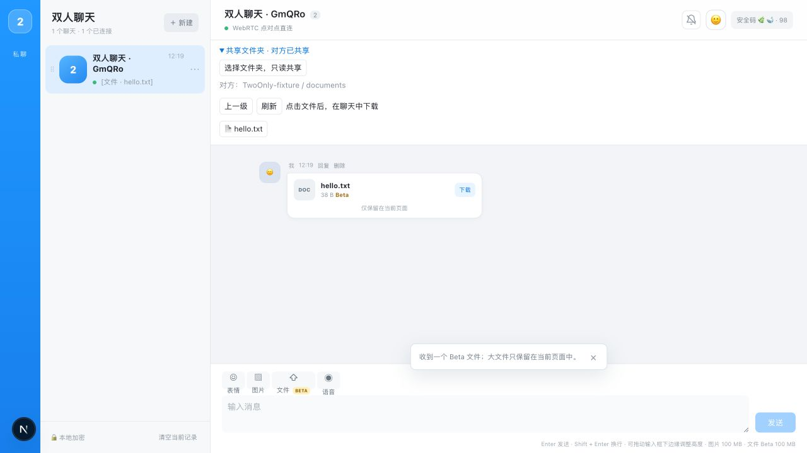
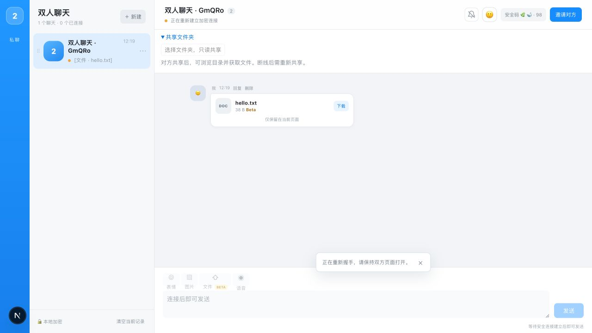

# 浏览器共享目录：审查与发布报告

[线上入口](https://twoonly-chat.vercel.app) · [功能提交 cdef120](https://github.com/MarcWebber/p2p-chat/commit/cdef120) · [核心实现](../src/chat/sharedFiles.ts)

验收日期：2026-09-24（北京时间）。

## 审查结论

当前状态处理规模合理，可以发布。共享能力复用现有房间身份、加密消息、WebRTC DataChannel 和附件传输；业务代码净增 **218 行**，连同测试及 README 净增 **288 行**。

授权动作就是共享方点击“选择文件夹，只读共享”，在浏览器目录选择器中确认。随后对方可以浏览这个目录及其子目录、点击文件获取附件，不需要逐次 ACK。停止共享或连接断开会撤销本次授权；重新连接后需要再次选择目录。共享方需要保持页面打开，已收到的附件可以继续保留。

## 状态是否复杂

实现直接保存本机授权、对方共享目录和当前请求。没有新增状态机框架，也没有增加服务端文件接口或依赖。

| 状态 | 用途与收回条件 |
| --- | --- |
| `root / localId` | 本机目录句柄和本次授权 ID；停止共享、断线或销毁房间时失效 |
| `peerId / peer / path / entries` | 对方授权及当前目录展示；撤销或断线后清空 |
| `pending` | 当前访问请求 ID；收到结果、失败、超时或撤销时清空；`busy` 由它直接推导 |
| `serving` | 正在服务的授权 ID；限制同一授权的并行请求，不阻塞重新授权 |
| `generation` | 丢弃断线后才返回的目录选择结果，避免过期操作重新打开共享 |
| `timer` | 请求等待上限 120 秒，结束时清理 |

界面名称、路径和列表属于展示数据。授权 ID 用于拒绝旧请求，请求 ID 用于匹配响应，两者职责不同。

本次复核修正了两处：

- 将 `busy` 改为从 `pending` 推导，消除两份状态分别维护的问题。
- 将读取占用标记绑定到授权 ID。旧文件读取尚未结束时，停止并重新共享也能立即服务新请求；旧读取结束不会释放新授权的占用标记。

撤销检查覆盖实际发送入口和背压等待后的发送位置，已排队但尚未发送的数据也会检查授权。已经发出的数据不能通过停止共享追回。

## 最终功能与范围

| 功能 | 当前行为 |
| --- | --- |
| 开始共享 | 使用 `showDirectoryPicker({ mode: "read" })` 取得浏览器授权目录 |
| 浏览文件 | 展示目录、进入子目录、返回上级、刷新；目录优先排序 |
| 获取文件 | 复用聊天附件传输，收到后展示下载链接 |
| 停止共享 | 本机句柄与授权失效，对方清空目录；正在等待的请求取消 |
| 断线与刷新 | 不持久化目录句柄或授权；再次共享需要重新选择 |
| 大小限制 | 单文件最多 100 MB；单目录最多 1000 项；路径最多 64 层 |
| 浏览器条件 | 共享方需要提供目录选择 API 的桌面浏览器；不支持时显示提示 |

文件路径逐段从已授权句柄解析，并拒绝 `..`、`.`、斜杠、反斜杠及 NUL。共享数据沿现有 AES-GCM 加密通道传递。

## 代码规模

统计基线为已有提交 `4932d08`，功能提交为 `cdef120`。按物理行计数，包含空行；本报告与截图另计。

| 范围 | 净增行数 |
| --- | ---: |
| 共享协议与目录访问 `sharedFiles.ts` | 150 |
| 文件面板 `SharedFilesPanel.tsx` | 28 |
| RoomRuntime、Hook、页面、样式与发送授权检查 | 40 |
| 业务合计 | **218** |
| 回归脚本与 README | 70 |
| 功能提交总计 | **288** |

Git 原始差异为 316 行增加、28 行删除，包含现有代码的替换与缩进调整。

## 发布时的依赖修复

生产构建发现既有依赖审计告警 3 项（1 critical、2 high）。已经更新对应补丁并重新验证，`npm audit --json` 结果为 **0 项**。

| 依赖 | 更新前 | 更新后 |
| --- | --- | --- |
| Next.js | 16.3.0 | 16.3.3 |
| sharp | 0.35.3 | 0.35.4 |
| nanoid | 3.3.17 | 3.3.19 |

Next.js 补丁覆盖官方公布的 [Windows 服务端漏洞](https://github.com/vercel/next.js/security/advisories/GHSA-p293-qw3h-jr36)与 [AVIF 图片优化漏洞](https://github.com/vercel/next.js/security/advisories/GHSA-2xp9-vwfh-vxw4)。依赖修复单独提交，只替换 package.json 与锁文件中的版本及校验信息，物理行数净增 0；没有增加依赖种类。

## 验证结果

| 验证层次 | 结果与证据 |
| --- | --- |
| 类型与构建 | `npm run typecheck`、`npm run build`、`git diff --check` 通过 |
| 共享逻辑回归 | `node scripts/test-shared-files.cjs` 通过：目录导航、文件内容、越界路径、过期授权、读取中撤销、重新共享、选择目录时断线 |
| 现有功能回归 | 通知脚本 4 项、信令降级脚本 7 项全部通过 |
| 浏览器连接 | 两个独立 origin 的实际页面通过 Supabase 信令建立 WebRTC 点对点直连 |
| 浏览目录 | 看到 `TwoOnly-fixture/documents`，进入后看到 `hello.txt`，可以返回上级 |
| 文件接收 | 实际接收 38 B 的 `hello.txt` 附件，并生成下载链接 |
| 撤销与恢复 | 停止共享后对方目录消失；再次共享后目录恢复；关闭共享方页面后对方目录清空、选择按钮禁用 |

浏览器验收使用临时页面取得浏览器沙盒中的真实 `FileSystemDirectoryHandle`，仅替代系统目录选择弹窗；目录读取、加密、信令、WebRTC 和附件接收均使用产品实现。临时页面已删除，正式构建仅包含首页、404、信令和 TURN 凭证路由。

系统原生目录选择弹窗未完成自动化验收。下载链接已点击，但自动化下载事件等待超时，因此只确认附件接收与下载入口，未确认文件最终保存到操作系统磁盘。100 MB 上限没有进行满容量压力验收。

## 生产发布

| 项目 | 结果 |
| --- | --- |
| 生产入口 | [twoonly-chat.vercel.app](https://twoonly-chat.vercel.app) |
| 本次部署 | [Vercel 部署详情](https://vercel.com/marcwebbers-projects/twoonly-chat/9h9yN1fRNogw3Kj4hivKPrFNrU8c) |
| 独立部署地址 | [twoonly-chat-57t3syyq6](https://twoonly-chat-57t3syyq6-marcwebbers-projects.vercel.app) |
| 部署 ID | `dpl_9h9yN1fRNogw3Kj4hivKPrFNrU8c` |
| 创建时间 | 2026-09-24 12:25:50（北京时间） |
| 发布代码 | [b945059](https://github.com/MarcWebber/p2p-chat/commit/b945059)，包含共享功能与依赖补丁 |
| 状态 | `READY`；通过 `vercel inspect` 确认正式域名指向本次部署 |
| 远端分支 | 功能与依赖补丁均已直接推送 `main` |
| 生产构建 | Next.js 16.3.3 构建通过，安装审计为 0 vulnerabilities |
| 发布后日志 | 按本次部署查询最近 10 分钟 error 级日志，未返回记录；仅代表即时检查结果 |

生产页面另行确认共享面板已显示。上述目录与附件双端验证在本地页面完成；生产截图验证发布后的入口和界面。报告与截图以文档提交随后推送，不改变上述发布代码。

## 验收截图

以下为本地双端真实 WebRTC 验收，使用合成文件；共享方截图底部明确标示了目录选择夹具。

共享方已授权目录，可以随时停止共享：

对方进入子目录并收到 38 B 文件：

停止共享后目录消失，已收到的附件仍保留：

连接断开后目录清空，文件共享入口禁用：

正式域名部署后的共享面板：

