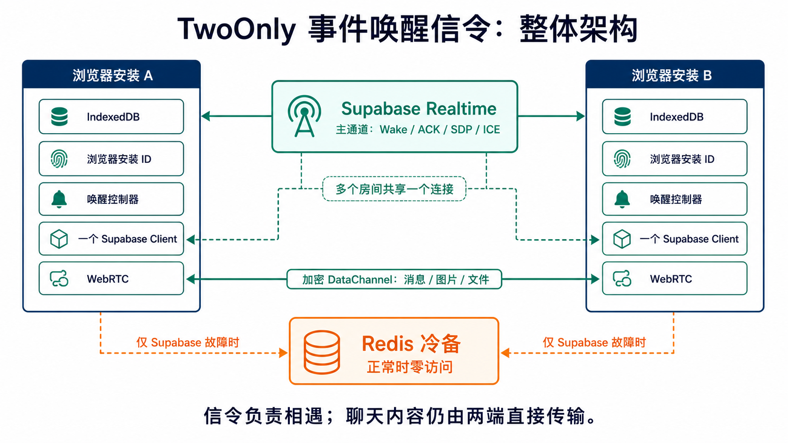
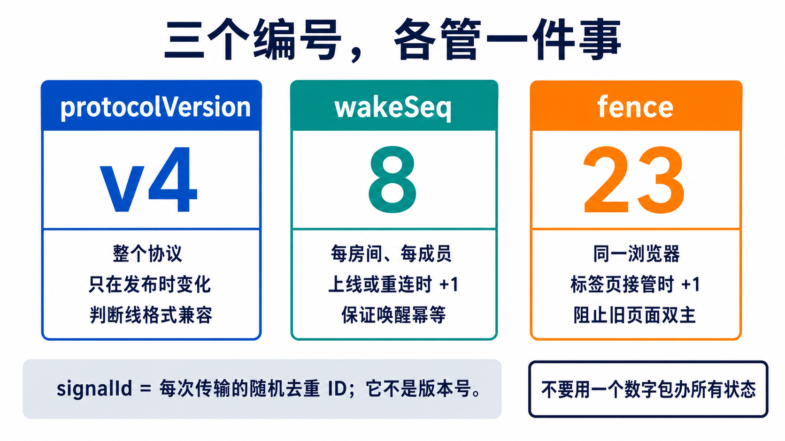
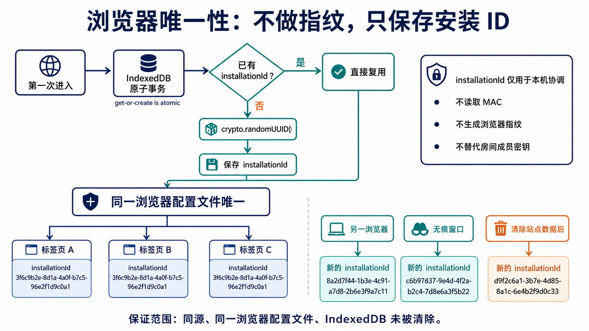
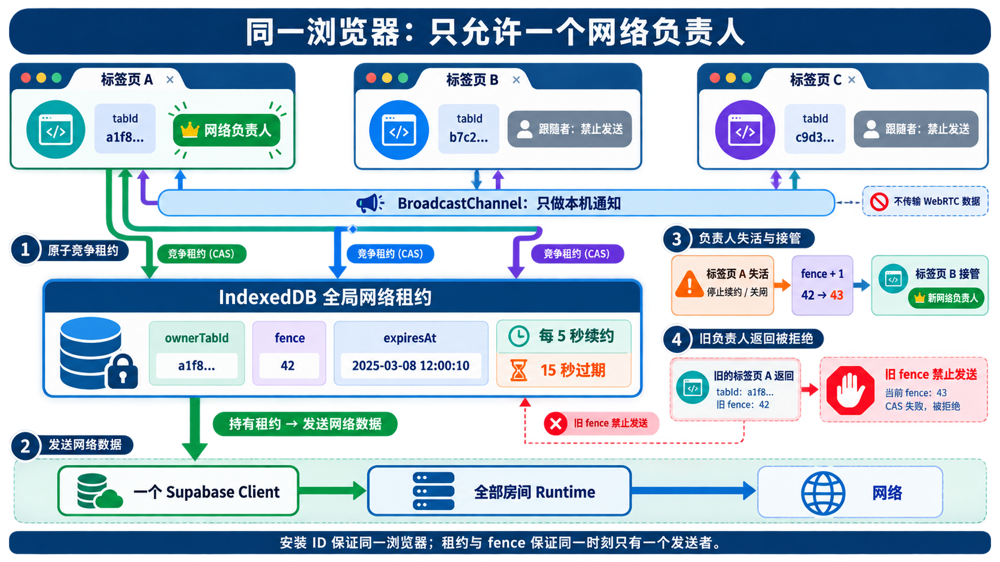
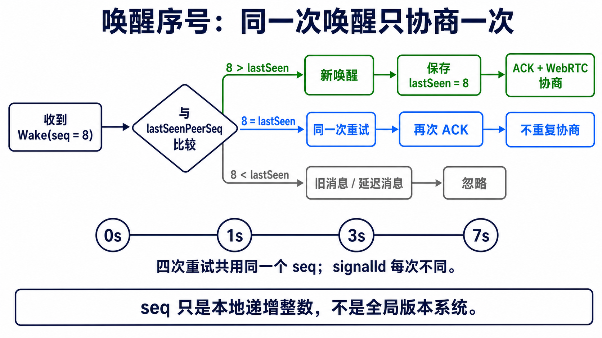
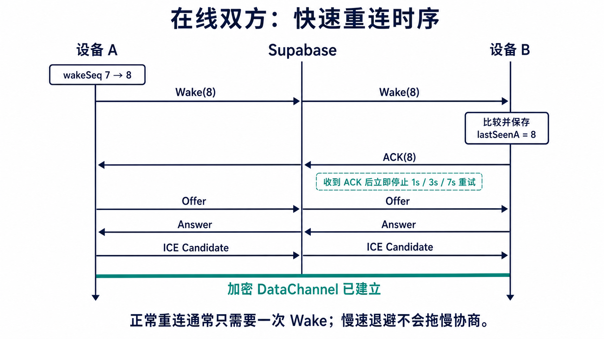
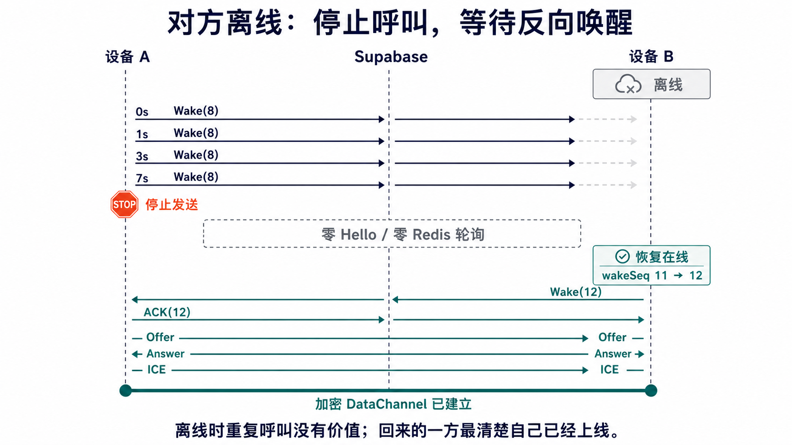
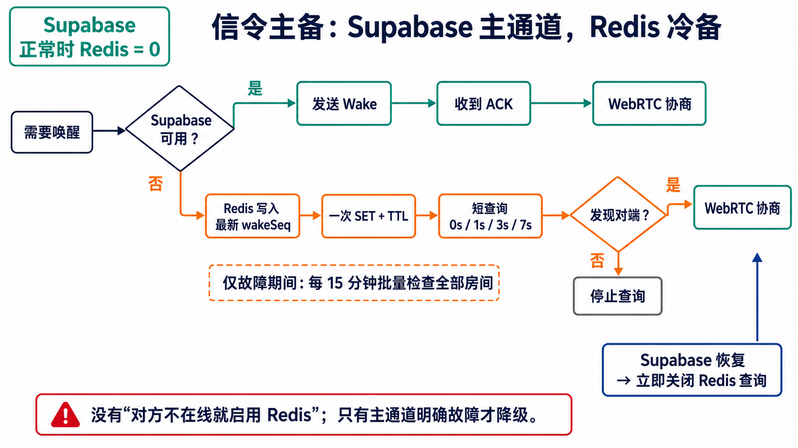
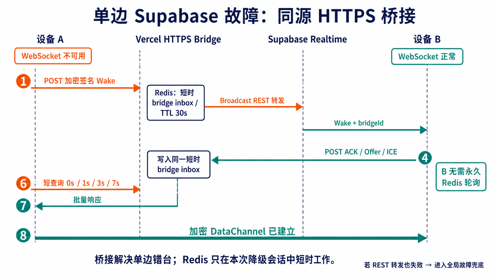
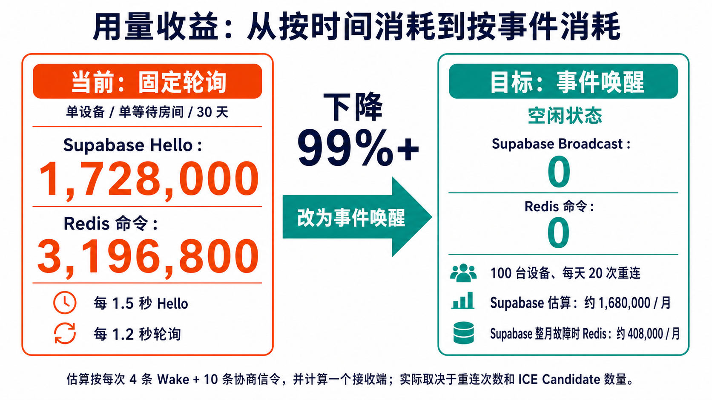

# RFC：事件唤醒信令与浏览器唯一性

> 状态：**Proposed / 尚未实现**
>
> 文档版本：1.0
>
> 目标协议版本：v4
>
> 本次变更范围：仅设计文档与 PNG 架构图，不修改产品代码、线上配置或部署行为。

## 1. 摘要

TwoOnly 当前在 WebRTC 尚未连通时，会按固定周期发送 Supabase Hello，并通过 Vercel HTTPS 持续轮询 Redis。它能提高建连成功率，但资源成本与“等待时长 × 房间数 × 页面数”成正比：对方离线越久、浏览器标签页越多、保存的房间越多，用量越高。

本 RFC 把信令改为**按事件唤醒**：

- 浏览器启动、恢复联网、从休眠恢复、Supabase 重新订阅或 WebRTC 断开时，才产生一个新的 `wakeSeq`；
- 每个 `wakeSeq` 最多在 `0s / 1s / 3s / 7s` 发送四次，收到 ACK 立即停止，四次都失败也立即停止；
- 对方恢复在线后，由恢复的一方主动发送自己的新 Wake，不再靠在线方无限呼叫；
- Supabase 是主通道；Redis 只在主通道被明确判定为不可用时短时介入，Supabase 正常时 Redis 用量为 0；
- 同一浏览器配置文件只保留一个随机安装 ID，并通过 IndexedDB 租约选出唯一网络标签页，避免多标签页重复建连和重复发送信令；
- 多个聊天室继续并存，但共享一个 Supabase 客户端和一个网络负责人。



### 1.1 图组目录

本 RFC 不使用 Mermaid；每个问题都拆成一张可以单独打开、评审和复用的 PNG：

| 图 | 回答的问题 |
| --- | --- |
| [01 整体架构](assets/wake-signaling/01-overall-architecture.png) | 浏览器、Supabase、Redis 和 P2P 数据通道如何分工 |
| [02 浏览器安装唯一性](assets/wake-signaling/02-browser-installation-identity.png) | 不做指纹时，唯一性可以保证到什么范围 |
| [03 单网络负责人](assets/wake-signaling/03-single-network-owner.png) | 多标签页如何避免重复连接和双主 |
| [10 三个编号](assets/wake-signaling/10-three-identifiers.png) | `protocolVersion`、`wakeSeq` 和 `fence` 为什么必须分开 |
| [04 Wake 序号判定](assets/wake-signaling/04-wake-sequence-decision.png) | 新事件、重复事件和旧事件如何处理 |
| [05 在线重连时序](assets/wake-signaling/05-online-reconnect-sequence.png) | 为什么首次重连仍然足够快 |
| [06 离线反向唤醒](assets/wake-signaling/06-offline-reverse-wake.png) | 对方离线后为什么可以停止呼叫 |
| [07 Supabase / Redis 主备](assets/wake-signaling/07-supabase-redis-failover.png) | 什么情况下才允许使用 Redis |
| [08 用量收益](assets/wake-signaling/08-usage-savings.png) | 空闲收益、100 设备预算和免费档边界 |
| [09 单边故障桥接](assets/wake-signaling/09-asymmetric-failure-bridge.png) | 只有一端 Supabase 故障时如何避免主备错台 |

## 2. 为什么要改

### 2.1 当前成本按时间增长

当前代码中的关键周期是：

| 路径 | 当前周期 | 位置 |
| --- | ---: | --- |
| Supabase Hello | 1.5 秒 | `RTC_POLICY.announceIntervalMs` |
| HTTPS Hello | 5 秒 | `SIGNAL_POLICY.httpsHelloIntervalMs` |
| HTTPS / Redis poll | 1.2 秒 | `SIGNAL_POLICY.httpsPollIntervalMs` |

以一个浏览器、一个未连通房间、连续等待 30 天估算：

- Supabase Hello 发送次数：`30 × 24 × 3600 ÷ 1.5 = 1,728,000`；
- Redis 查询命令：`30 × 24 × 3600 ÷ 1.2 = 2,160,000`；
- HTTPS Hello 每次在 Redis 执行 `XADD + EXPIRE` 两条命令：`30 × 24 × 3600 ÷ 5 × 2 = 1,036,800`；
- Redis 合计约 `3,196,800` 条命令。

这里的 Supabase 数字只是**发送次数**。Supabase Realtime 的计费用量还会把发送和每个订阅接收者分别计数；一个发送者和一个接收者通常相当于两条 Realtime message。官方免费额度目前是每月 2,000,000 条 Realtime messages，免费并发连接上限是 200。Upstash Redis 免费额度目前是每月 500,000 条命令。

参考：

- [Supabase Realtime Messages 计量方式](https://supabase.com/docs/guides/platform/manage-your-usage/realtime-messages)
- [Supabase Realtime Reports 与并发连接](https://supabase.com/docs/guides/realtime/reports)
- [Upstash Redis 定价与免费额度](https://upstash.com/pricing/redis)

### 2.2 多标签页会放大问题

当前每个房间运行时都会创建自己的信令 transport，每个页面也会恢复全部房间。用户开三个标签页，相当于把 Hello、轮询、Supabase 连接和 WebRTC 运行时再复制三份。页面越多，重复请求越多；网络抖动时，多个页面还会同时进入重连。

### 2.3 对方离线时，无限呼叫没有信息增益

第四次 Wake 仍未收到 ACK 后，继续每 1.5 秒发送 Hello 并不能让离线浏览器执行 JavaScript。真正能确认“我已经回来”的，是恢复在线的那一端。因此更合理的协议是：在线方停止，对方回来后反向唤醒。

## 3. 目标与非目标

### 3.1 目标

1. 空闲或对方长期离线时，Supabase 业务 Broadcast 和 Redis 命令都降为 0。
2. 双方在线时，首次 Wake 立即发送，不以长退避牺牲快速重连。
3. 同一浏览器配置文件、同一站点数据范围内，只允许一个标签页拥有网络发送权。
4. 保留多个聊天室同时在线的能力，但共享一个 Supabase WebSocket。
5. 保留现有每房间 P-256 ECDSA 成员身份和永久双席语义。
6. 所有状态均有上界：重试次数、租约时长、Redis 查询窗口和队列速率都可预测。

### 3.2 非目标

- 不读取 MAC 地址、浏览器指纹、广告 ID 或系统硬件标识。
- 不把浏览器安装 ID 当作房间成员身份或授权凭据。
- 不提供离线信箱；聊天正文仍不进入 Supabase 或 Redis。
- 不承诺网页在操作系统深度休眠、锁屏冻结或浏览器被杀死时仍能接收事件。
- 不在本 RFC 中直接修改代码、数据库版本、Vercel 或 Supabase 配置。

## 4. 三个容易混淆的“编号”

这套设计不使用一个包办所有事情的复杂版本号，而是把三个不同问题分开：



| 字段 | 作用域 | 何时变化 | 解决的问题 |
| --- | --- | --- | --- |
| `protocolVersion` | 整个协议 | 发布不兼容线格式时，由代码升级 | v3 与 v4 客户端能否理解彼此 |
| `wakeSeq` | 每房间、每成员 | 一次有意义的上线或重连事件 | 同一个唤醒是否已经处理 |
| `fence` | 同一浏览器配置文件 | 网络负责人每次换届 | 旧标签页恢复后能否继续发送 |

此外，每次实际发送仍生成随机 `signalId`，只用于传输层去重。同一个 `wakeSeq` 的四次重试拥有不同 `signalId`，接收方可以重复 ACK，但只启动一次协商。

## 5. 浏览器唯一性：保证到什么范围



### 5.1 保证范围

浏览器无法在不登录、不依赖服务端账户、也不做指纹的前提下，证明“清理数据前后仍是同一台物理机器”。本 RFC 的保证范围明确为：

> 同一 Origin、同一浏览器配置文件、IndexedDB 未被清理时，所有标签页读取到同一个随机 `installationId`。

以下情况会得到新的安装 ID，这是预期行为：

- Chrome 与 Safari；
- 同一浏览器的两个 Profile；
- 普通窗口与隔离的无痕存储；
- 用户清除了站点数据；
- 浏览器或隐私策略主动分区、回收了站点存储。

### 5.2 原子创建

在 IndexedDB `settings` store 中增加：

```text
key: browser-installation
value:
  version: 1
  installationId: <128-bit random UUID>
  createdAt: <unix ms>
```

创建过程必须在单个 `readwrite` transaction 中完成：

1. `get("browser-installation")`；
2. 已存在则返回原值；
3. 不存在则用 `crypto.randomUUID()` 创建并 `put`；
4. 等待 transaction complete；
5. 再把实际落库结果作为运行时身份。

不能先在两个标签页内各生成一个 ID，再用普通写入“最后写入者获胜”；否则先启动的页面可能继续持有一个没有落库的临时 ID。

### 5.3 失败时关闭信令，而不是生成临时身份

如果 IndexedDB 无法打开、事务被阻塞或写入失败，页面仍可展示错误和本地帮助，但不得启动 Supabase、Redis 或 WebRTC 信令。临时 ID 会让另一个标签页或下一次刷新看起来像新浏览器，无法满足唯一性承诺。

### 5.4 隐私边界

- `installationId` 默认只留在本机，不进入邀请链接、Supabase topic、日志或聊天消息；
- 如果服务端限流需要稳定但不可跨房间关联的键，只发送 `roomBrowserId = HMAC(roomSecret, installationId)`；
- 同一浏览器在不同房间产生不同的 `roomBrowserId`，服务端不能据此拼出跨房间使用轨迹；
- `roomBrowserId` 只用于资源分组和限流，不参与成员验签；
- 房间授权仍由现有 `RoomMemberIdentity`、邀请中的 owner 公钥和永久双席锁定完成。

随机 128 位 ID 的碰撞概率在产品规模下可以忽略，但它不是法律或硬件意义上的绝对唯一证明。

## 6. 多标签页：只允许一个网络负责人



### 6.1 全局租约

每个标签页启动时生成一次不持久化的 `tabId`。IndexedDB `settings` store 增加全局租约：

```text
key: network-owner-lease
value:
  ownerTabId: <ephemeral tab id>
  fence: <monotonic integer>
  expiresAt: <unix ms>
```

租约参数建议：

| 参数 | 建议值 | 说明 |
| --- | ---: | --- |
| 续租周期 | 5 秒 | 网络负责人在单个事务内续租 |
| 过期时间 | 15 秒 | 页面被冻结后，其他标签页有界接管 |
| 正常关闭 | 立即释放 | `pagehide` 中尽力释放，并通过 BroadcastChannel 通知 |
| 接管 | `fence + 1` | 新负责人原子写入后才允许发网络请求 |

### 6.2 fencing 防止“双主”

仅靠 `expiresAt` 不够。旧负责人可能被系统冻结 30 秒，新负责人已接管；旧页面随后恢复，内存里仍认为自己是负责人。为此：

1. 每次接管都原子递增 `fence`；
2. 所有发送、重连和可见性恢复入口都重新读取租约；
3. 只有 `ownerTabId` 和 `fence` 都匹配，才允许发送；
4. 发现更高 `fence` 后，旧页面立即 dispose 自己的 Supabase client、WebRTC runtimes 和定时器；
5. 可选的同源 HTTPS 限流请求也携带当前 fence 对应的短时租约证明，过期 fence 不能继续消耗 Redis。

这保证的是“同一浏览器配置文件最终只有一个有效网络发送者”。短暂并发窗口由原子事务和发送前 fence 检查关闭。

### 6.3 标签页之间如何协作

- 负责人拥有一个共享 Supabase client、全部房间订阅和全部 `RoomRuntime`；
- 跟随者只读 IndexedDB 快照，不创建 Supabase client，不发送 Wake，也不建立 WebRTC；
- `BroadcastChannel` 只发送“数据已变化”“请求接管”“负责人已释放”等同源控制通知，不传聊天正文和 WebRTC 数据；
- 用户在跟随者标签页尝试发送消息时，页面先请求接管；旧负责人释放、新负责人取得更高 fence 后，再恢复全部房间；
- 不建议仅凭 `visibilitychange` 自动抢占，否则用户快速切换标签页会造成负责人来回抖动。

### 6.4 多聊天室仍然成立

“一个网络负责人”不等于“只能开一个房间”。负责人内部仍保存多个房间运行时，只是：

- 一个 Supabase client 订阅多个 room channel；
- 每个房间保持独立的 `wakeSeq`、成员密钥、WebRTC 和 DataChannel；
- 活跃房间的 Wake 最高优先级；后台房间在启动时加入带轻微抖动的发送队列；
- 全局发送队列建议采用 `8 events/s`、burst `12` 的令牌桶，避免大量保存房间同时恢复时形成尖峰。

Supabase 官方说明一个客户端连接可以订阅多个 channel，因此共享 client 能直接减少多房间和多标签页产生的并发 WebSocket。

事件唤醒期间，这个共享 WebSocket 仍保持订阅，才能接收对方稍后的反向 Wake；“空闲为 0”指应用层 Broadcast 和 Redis 命令为 0，不是关闭 WebSocket，也不是并发连接数为 0。

## 7. Wake 协议



### 7.1 触发条件

只有下面这些有意义的状态变化才创建新 `wakeSeq`：

- 网络负责人首次取得租约；
- 页面收到用户“重新连接”操作；
- 浏览器从 `offline` 变为 `online`；
- 页面从冻结或长时间隐藏状态恢复；
- Supabase channel 从失败状态重新进入 `SUBSCRIBED`；
- `RTCPeerConnection` 在宽限期后进入 `failed` 或需要 ICE restart；
- 前一个网络负责人退出，新负责人接管。

同一房间 15 秒内出现多个触发时合并成一个新序号。DataChannel 正常打开时，不因为普通焦点切换产生 Wake。

### 7.2 建议载荷

下面是概念字段，不代表本 RFC 已经提交线协议实现：

| 字段 | 含义 |
| --- | --- |
| `protocolVersion: 4` | 线协议版本 |
| `type: "wake" \| "wake-ack"` | 唤醒或确认 |
| `roomId` | 房间路由键 |
| `fromMemberId` | 现有成员公钥派生 ID |
| `wakeSeq` | 该成员在该房间的持久化递增序号 |
| `epoch` | 当前页面/WebRTC 轮次 |
| `signalId` | 本次传输的随机去重 ID |
| `sentAt` | 发送时间，用于有限重放窗口 |
| `replyPath` | 可选的签名降级返回路径；包含随机 bridge ID，不包含安装 ID |
| `signature` | 现有房间成员私钥对完整路由信令签名 |

`wakeSeq` 必须在 IndexedDB 事务中原子递增。只允许网络负责人分配和发送序号，避免多标签页竞争。

### 7.3 接收规则

假设收到 A 的 `Wake(n)`，本机持久化的值是 `lastSeenWakeSeq[A]`：

| 判断 | 动作 |
| --- | --- |
| `n > lastSeen` | 保存 `n`，回复 ACK，启动一次协商 |
| `n == lastSeen` | 再次回复 ACK，但不重复协商 |
| `n < lastSeen` | 视为旧事件，忽略 |

先验签，再比较序号。成员公钥不属于房间双席时，仍按现有规则拒绝；知道 room ID 或安装 ID 都不能占席。

### 7.4 重试和限流

每个新 Wake 的发送计划固定为：

```text
0s → 1s → 3s → 7s → stop
```

- 第一次立即发送，保证快速重连；
- 任意一次收到匹配 ACK，取消余下任务；
- 四次都失败后，不再自动创建新序号；
- 只有新的触发条件才允许产生下一序号；
- 每个房间同一时刻只允许一个活跃 Wake；
- 全局发送队列限制尖峰，活跃房间优先；
- `signalId` 负责一次传输去重，`wakeSeq` 负责业务幂等，两者不能互相替代。

## 8. 双方在线：快速重连时序



1. A 因上线、恢复或连接失败，把自己的房间序号从 7 原子增加到 8。
2. A 立即通过 Supabase 发送 `Wake(8)`。
3. B 验签并发现 `8 > lastSeenA`，保存序号，回复 `ACK(8)`，只启动一次协商。
4. A 收到 ACK 后取消 1、3、7 秒的后续重试。
5. Offer、Answer 和 ICE Candidate 继续走现有签名信令。
6. 加密 DataChannel 打开后，信令进入静默状态。

快速路径没有等待指数退避；退避只覆盖首次事件丢包或对方响应稍慢的情况。

## 9. 对方离线：停止并等待反向唤醒



1. A 在 0、1、3、7 秒发送同一 `wakeSeq=8` 的四个传输尝试。
2. B 离线，A 收不到 ACK；7 秒尝试后 A 停止。
3. 此后 A 不再发送 Hello，也不因为“对方仍离线”启动 Redis 轮询。
4. B 稍后恢复在线，把自己的序号从 11 增至 12，主动发送 `Wake(12)`。
5. A 在线并订阅房间 channel，立即 ACK；双方开始协商。

因此离线一小时和离线一个月的空闲成本相同：都只有开始时的有界四次尝试。

## 10. Supabase 主通道与 Redis 冷备



### 10.1 路由原则

| 状态 | Supabase | 同源 HTTPS / Redis |
| --- | --- | --- |
| 双方 Supabase 已订阅且可发送 | 发送 Wake/ACK/协商 | 0 请求 |
| 对方未 ACK，但本机 Supabase 本身健康 | 有界重试后停止 | 0 请求 |
| 仅本机 Supabase 明确失败 | Vercel 通过 Broadcast REST 桥接到健康对端 | 仅本次降级会话短时工作 |
| Supabase 全局故障 | 主路径不可用 | 短时状态 + 低频批量兜底 |
| 本机 Supabase 恢复 | 立即恢复主路径 | 立即停止查询 |

“没有收到对方”不能等价为“Supabase 故障”。对方可能只是离线；此时启用 Redis 会重新引入无限消耗。

### 10.2 单边故障必须解决“错台”



如果只有 A 无法访问 Supabase，而 B 的 Supabase 正常，仅让 A 写 Redis 并不能快速重连：B 没有故障，也就没有理由去 Redis 轮询。这正是主备通道的“错台”问题。

本 RFC 用同源 HTTPS Bridge 收敛：

1. A 确认自己的 Supabase WebSocket 不可用后，生成随机 bridge ID，把它放进受成员签名保护的 `replyPath`，再将加密 Wake POST 到 Vercel；
2. Vercel 把它写入一个 TTL 30 秒的短时 bridge inbox，并调用 [Supabase Broadcast REST API](https://supabase.com/docs/guides/realtime/broadcast#broadcast-using-the-rest-api) 转发到原 room channel；
3. B 仍通过自己健康的 Supabase WebSocket 收到 Wake，同时看到不透明 `bridgeId`；
4. B 针对本次协商把 ACK、Offer、Answer 和 ICE 批量 POST 回同一个 bridge inbox；
5. A 只在本次 `0s / 1s / 3s / 7s` 窗口读取批量响应；协商开始后可进入最长 30 秒的有界收件箱窗口；
6. DataChannel 打开、窗口到期或 Supabase 恢复，bridge inbox 立即过期或停止读取。

B 不需要常驻 Redis 轮询，A 也只在已经观测到 provider error 时使用同源桥接。如果 Vercel 到 Supabase 的 REST 转发也失败，才进入全局故障兜底。

### 10.3 Redis 从永久事件流改为短时状态

发现阶段不需要永久 Redis Stream。每个房间/成员只需短时保存最新加密 Wake 状态：

```text
SET twoonly:wake:<opaque-room-key>:<member-slot> <encrypted-latest-state> EX <ttl>
```

一旦发现对端，ACK/Offer/Answer/ICE 不能被一个“latest value”相互覆盖，因此本次降级协商允许使用一个 TTL 30 秒、有严格长度上限的 bridge inbox。它只在真实降级事件中存在，DataChannel 打开后立即停止，不再保留当前的常驻 Stream 行为。

客户端在本次事件的 `0s / 1s / 3s / 7s` 窗口检查对端最新状态，之后停止。Supabase 长时间全局故障时，可以只在网络负责人存活期间每 15 分钟批量检查一次全部房间，而不是每个房间每 1.2 秒单独 poll。这个低频兜底提供的是最终发现，不承诺正常路径的秒级速度。

Redis 只看到不透明房间键、成员槽位、序号密文和 TTL，不保存聊天正文。服务端仍需做按 IP、`roomBrowserId` 和不透明房间键的多级限流；任何一层命中都返回 `429` 和 `Retry-After`，客户端不得立即重试。

### 10.4 故障判定

只有以下证据之一成立，才进入 Redis 冷备：

- Supabase client 明确返回 channel error/timeout；
- WebSocket 连接失败且在短窗口内无法重新订阅；
- 发送返回 provider error，而不是单纯没有 peer ACK。

恢复 `SUBSCRIBED` 后，立即取消 Redis 定时任务，并产生一个新的 Wake 验证主路径。

## 11. 用量收益与容量估算



> 图中的 Redis `408,000/月` 是“15 分钟批量发现 + 每事件一次写和一次读”的**基础控制面预算**，不是包含全部 Offer/Answer/ICE inbox 命令的安全上界。完整月度故障必须由硬额度熔断保护，不能据此承诺免费档可无限维持全部协商。

### 11.1 空闲收益

| 场景 | 当前固定周期 | 事件唤醒目标 |
| --- | ---: | ---: |
| 单设备、单等待房间、30 天 Supabase Hello 发送 | 1,728,000 | 0 |
| 单设备、单等待房间、30 天 Redis 命令 | 3,196,800 | 0 |

空闲状态下降接近 100%。只要真实重连事件远少于每 1.5 秒一次，总体下降就能超过 99%。这里的 0 是应用业务事件，不包含保持一个 Supabase WebSocket 所需的平台内部连接维护。

### 11.2 100 台在线设备的保守模型

假设：

- 100 台设备；
- 每台每天发生 20 次完整唤醒/重连事件；
- 每次按最坏四条 Wake 加十条 Offer/Answer/ICE 信令，共 14 次发送；
- 每次发送有一个订阅接收端，因此按两条 Supabase Realtime message 计量。

月用量：

```text
100 × 20 × 30 × 14 × 2 = 1,680,000 Realtime messages / 月
```

这低于当前 2,000,000/月免费额度，但只是一组容量预算，不是平台 SLA。ICE Candidate 数量、重连次数、额外订阅者和 Supabase 计费规则变化都会改变结果。上线前应以实际 metrics 校准 `14` 这个系数。

### 11.3 Supabase 整月故障的 Redis 基础预算

假设 100 台设备在故障期间：

- 每 15 分钟批量查询一次所有房间：`100 × 96 × 30 = 288,000` 条查询；
- 每台每天 20 个事件，每个事件按一次写和一次读：`100 × 20 × 30 × 2 = 120,000` 条命令；
- 基础控制面合计约 `408,000` 条命令/月。

它低于当前 Upstash 500,000/月免费额度，但只剩 92,000 条命令，无法覆盖大量真实协商产生的 bridge inbox 写入和读取。因此“Supabase 整月全局故障 + 100 台设备每天 20 次完整重连”不能承诺在 Redis 免费档内持续正常工作。批量检查只能在 Supabase 明确故障时启用，并应配置月度 70% / 85% / 95% 告警；达到硬阈值后停止后台检查，只保留用户主动重连。

### 11.4 多设备是否会出问题

共享一个 Supabase client 后，一台设备无论保存多少房间，通常只占一个 Realtime connection。按当前免费并发上限 200 估算：

- 理论上约 200 台同时在线设备；
- 若全部是成对聊天，约 100 对同时在线用户；
- 多标签页不再重复占连接；
- 月消息额度可能比并发连接更早成为瓶颈，具体取决于真实事件率。

Supabase 当前对大多数计划允许一个连接加入最多 100 个 channel。TwoOnly 应把它视作一台浏览器同时在线房间数的硬边界；接近边界时应明确提示或暂停最旧房间，而不是静默创建无界新连接。

超过免费档并不会破坏协议正确性，但可能遭遇平台配额限制。产品应在接近额度前降级，而不是依赖供应商突然拒绝后再恢复。

## 12. 持久化模型提案

不要求新增 object store；可以继续使用现有 `settings` 和 `rooms`：

| 存储位置 | 新字段/记录 | 说明 |
| --- | --- | --- |
| `settings` | `browser-installation` | 原子创建的安装 ID |
| `settings` | `network-owner-lease` | `ownerTabId + fence + expiresAt` |
| `rooms` | `localWakeSeq` | 本成员下一次唤醒序号 |
| `rooms` | `peerLastSeenWakeSeq` | 已处理的对端最新序号 |
| 内存 | `tabId` | 页面级，不持久化 |
| 内存 | active Wake timers | 收 ACK、丢租约或 dispose 时取消 |

数据库升级必须保留现有房间秘密、成员私钥、对端公钥、历史密文、房间资料和头像资料。新增字段缺失时从 0 开始，不重写历史消息桶。

## 13. 安全与滥用控制

### 13.1 身份分层

| 身份 | 是否持久化 | 是否参与授权 | 是否发给服务端 |
| --- | --- | --- | --- |
| `installationId` | 是，全局 settings | 否 | 默认否 |
| `roomBrowserId` | 可计算，不必持久化 | 否，只限流 | 必要时发送 |
| `tabId` | 否 | 否，只参与本地选主 | 否 |
| `memberId` / 成员公钥 | 是，每房间 | 是 | 随签名信令发送 |

### 13.2 服务端建议限流

冷备 HTTPS 端点建议同时设置：

- 单 IP：吸收脚本和匿名洪泛；
- 单 `roomBrowserId`：限制同一浏览器在同一房间的误重试；
- 单不透明房间键：防止两端合计超限；
- 全局熔断：接近 Upstash 月额度时关闭后台查询；
- 请求体和批量房间数上限；
- `429 Retry-After`，客户端遵守服务端退避，不允许无界自重试。

客户端限流负责网络抖动和多标签页；服务端限流负责被篡改客户端和恶意请求，两者不能互相替代。

### 13.3 重放与幂等

- `signalId`、`sentAt`、`wakeSeq`、epoch 和路由字段都应纳入成员签名；
- 接收前验证协议版本、时间窗、成员公钥和签名；
- `wakeSeq == lastSeen` 只重发 ACK，不再创建 Offer；
- 更旧序号直接丢弃；
- `fence` 只约束本机标签页，不代替远端成员签名。

## 14. 锁屏、待机与真正的系统唤醒

事件唤醒能解决的是：页面 JavaScript 仍在运行，或从冻结状态恢复之后，快速而有界地重新建连。

它不能绕过操作系统的页面冻结策略：

- 锁屏或待机时，定时器、WebSocket 和 WebRTC 可能被冻结或被系统回收；
- 页面被冻结期间，Supabase 和 Redis 都无法让 JavaScript 自己执行；
- 页面恢复后，新网络负责人会取得/续租 fence，并立即产生 Wake；
- 如果需要像 QQ 一样在页面被杀死后仍显示系统通知，需要单独引入 Service Worker + Web Push，以及保存最小离线通知元数据的服务端；这属于另一项产品设计。

因此本 RFC 不宣称“锁屏永不断线”，而是保证“恢复后立即重连，离线期间不无限消耗”。

## 15. v3 到 v4 的迁移

1. v4 客户端先加入安装 ID 和本地租约，但保持现有 v3 信令行为，由 feature flag 关闭事件唤醒。
2. 验证单标签、多标签、冻结恢复和 IndexedDB 失败场景。
3. 增加 v4 Wake/ACK，接收端按 `protocolVersion` 分流。
4. 在一段兼容窗口内，v4 遇到 v3 对端可回退到有界 v3 Hello，但必须设置总时限，不能恢复永久轮询。
5. 两端均为 v4 后，关闭固定 Hello 和健康状态下的 Redis poll。
6. 最后把 Redis Stream 迁移为最新 Wake 状态，并保留可回滚开关。

旧房间的永久双席公钥不变。浏览器安装 ID 的新增不能重置或替换成员身份。

## 16. 建议实施切片

| 阶段 | 主要改动 | 独立验收 |
| --- | --- | --- |
| A. 浏览器唯一性 | IndexedDB 原子安装 ID、租约、fence、跟随者 UI | 三标签页始终只有一个网络负责人 |
| B. 共享连接 | 单 Supabase client、多 channel、运行时归属迁移 | 多房间只占一个 WebSocket |
| C. Wake 协议 | v4 payload、持久化序号、ACK、0/1/3/7 调度 | 快速重连且重试有界 |
| D. Redis 冷备 | provider 故障判定、最新状态、批量检查、429 | Supabase 健康时 Redis 为 0 |
| E. 观测与发布 | metrics、配额告警、feature flag、兼容回退 | 小流量验证后逐步放量 |

预计会涉及的现有模块：

- `src/storage/chatStorage.ts`：原子安装 ID、租约和 per-room Wake 状态；
- `src/chat/useTwoOnlyChat.ts`：网络负责人生命周期、标签页接管；
- `src/chat/roomRuntime.ts`：负责人拥有全部运行时；
- `src/signal/supabaseSignalTransport.ts`：共享 Supabase client；
- `src/signal/signalTransport.ts`：主备路由与 provider 健康判定；
- `src/signal/httpsSignalTransport.ts`：短窗口 Redis 冷备；
- `src/signal/serverSignalStore.ts`：最新状态、批量读和服务端限流；
- `src/webrtc/WebRtcSession.ts`：Wake/ACK 和固定 Hello 下线；
- `src/config/policy.ts`：重试、租约、令牌桶和配额参数。

## 17. 验收矩阵

| 场景 | 必须满足 |
| --- | --- |
| 首次打开 | 原子生成一个安装 ID；一个标签页取得 fence |
| 同时打开三个标签页 | 只有一个 Supabase WebSocket 和一组房间运行时 |
| 两标签页同时抢租约 | IndexedDB 最终只有一个 owner；loser 不发网络请求 |
| 旧负责人冻结后恢复 | 发现更高 fence，立即停止发送并 dispose |
| IndexedDB 不可用 | 明确阻塞信令，不创建临时安装 ID |
| 双方在线 | 首次 Wake 可立即收到 ACK 并协商 |
| Wake 首次丢包 | 按 1/3/7 秒重试，ACK 后取消余下任务 |
| 对方离线一小时 | 四次后完全静默，无固定 Hello、无健康 Redis poll |
| 对方恢复 | 恢复方主动新 Wake，双方重连 |
| 重复 Wake | 重复 ACK，不重复 Offer |
| 旧 Wake | 忽略，不刷新 peer lock 或协商状态 |
| Supabase 健康、对方离线 | Redis 请求为 0 |
| Supabase 明确故障 | Redis 只在短窗口或 15 分钟批量周期工作 |
| Supabase 恢复 | Redis 定时器和请求立即停止 |
| 多个已保存房间 | 共享一个 Supabase client，各房间序号和 WebRTC 独立 |
| 第三成员尝试加入 | 仍被现有永久双席验签拒绝 |
| 锁屏后恢复 | 不承诺锁屏期间在线；恢复后立即续租/接管并 Wake |

## 18. 观测、预算与回滚

至少记录不含秘密的聚合指标：

- 每浏览器有效 Supabase connection 数；
- 租约接管次数、fence 冲突次数、旧负责人停止次数；
- Wake 创建数、每个 Wake 的尝试次数、ACK 延迟和超时率；
- 每次协商的 Offer/Answer/ICE 数量；
- Redis 降级进入原因、命令估算、持续时间和退出原因；
- 每日 Realtime messages 估算与供应商实际用量差异。

回滚必须由 feature flag 控制，并有两个层次：

1. 可以关闭 Redis 冷备，仅保留 Supabase Wake；
2. 可以暂时恢复**有总时限**的 v3 兼容 Hello，但不得恢复无界 Redis 轮询。

告警建议：月额度预测达到 70% 提醒，85% 降低后台检查，95% 关闭非用户触发的 Redis 降级，只保留用户主动重连。

## 19. 结论

这个方案的核心不是“增加一个不断变化的版本号”，而是三件相互独立的小机制：

1. 安装 ID 回答“这些标签页是否属于同一个浏览器存储空间”；
2. 租约和 fence 回答“现在究竟哪个标签页可以联网”；
3. `wakeSeq` 回答“这次上线事件是否已经处理”。

三者叠加后，TwoOnly 可以保留快速重连和多聊天室，同时把资源模型从“只要页面开着就持续花费”改成“真正发生上线或断线事件时才花费”。浏览器休眠期间不制造虚假的在线承诺，恢复后再立即、有限、可幂等地唤醒。
