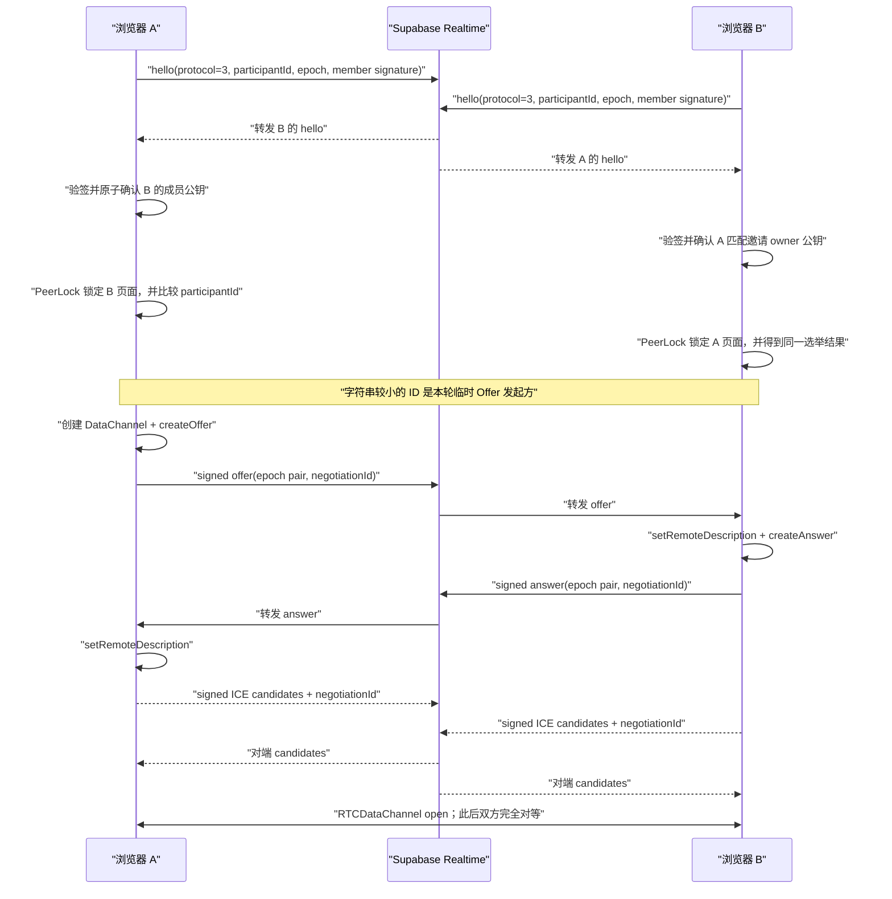

# WebRTC、双工通道与加密

## 1. 为什么仍然需要信令服务

WebRTC 定义了浏览器之间的连接能力，但不规定应用如何交换 SDP 和 ICE Candidate。TwoOnly 同时使用 Supabase Realtime Broadcast 和同源 Vercel HTTPS 作为信令通道；它们帮助双方找到彼此，连接建立后不承载聊天消息。HTTPS 队列中的信令负载先用邀请秘密加密，两条通道里的 protocol v3 信令都带每房间成员签名。

官方说明可参考 [WebRTC Peer Connection](https://webrtc.org/getting-started/peer-connections)：Offer/Answer 描述双方能力，ICE Candidate 描述可能的网络路径，应用需要自行提供信令机制完成交换。

## 2. Offer/Answer 建连过程



图中 A 只是恰好拥有字典序更小的随机 `participantId`；下次打开页面，临时 Offer 发起方可能变成 B。这不是用户身份或权限角色。持久成员判断来自 IndexedDB 中的每房间 P-256 公私钥和已登记对端公钥，与页面级 `participantId` 分开。

实现中有几项可靠性保护：

- 所有信令显式标记 `protocol: 3`；Hello、Offer、Answer、Candidate 和 Rejected 都包含成员公钥、由公钥派生的 `memberId` 和 P-256 ECDSA 签名，签名绑定房间 ID、会话秘密与稳定信令内容，旧格式或验签失败的信令不会进入 v3 状态机；
- 创建者公钥以 `#secret=…&owner=…` 放在邀请 Fragment 中。创建者以 IndexedDB 单个读写事务登记首个验签通过的第二成员；此后只接受两席公钥签出的信令；
- 双方都发送 Hello，并用 `participantId` 字符串顺序确定唯一临时 Offer 发起方，避免双方同时 Offer；
- 每次协商生成 `negotiationId`，并携带发送端 `fromEpoch` 与目标 `toEpoch`，过期 Answer 会被忽略；
- 所有信令进入 Promise 队列串行处理，避免并发修改 `signalingState`；
- 重复 Offer 会复用已经生成的 Answer，而不是重复设置远端描述；
- 远端描述尚未设置时，ICE Candidate 按 `peerId + local/remote epoch + negotiationId` 分桶缓存，命中当前协商后才统一补入；
- 新协商会清空旧 PeerLock 页面实例和协商状态，旧 Peer/DataChannel 回调不能覆盖新状态；持久成员名单不会随断线、空房或 PeerLock 超时清空；
- PeerConnection 进入 `disconnected` 后先观察 2.5 秒，避免把瞬时抖动误判为断线；进入 `failed` 或 DataChannel 关闭时通常在 800 ms 后自动重握手。新一轮会递增 local epoch、双方重新 Hello，并重新选出临时 Offer 发起方；
- 用户可点击“立即重连”跳过等待。每次页面加载使用新的随机 participant ID，epoch 用来区分同一页面内的重连轮次；只有持有原房间私钥的成员页面才能通过签名校验。

## 3. 双工 DataChannel

选举出的临时 Offer 发起方在 `RTCPeerConnection` 上创建：

```ts
peer.createDataChannel("twoonly-messages", { ordered: true })
```

另一端通过 `peer.ondatachannel` 取得同一逻辑通道。通道打开后，Offer 发起方这一临时差异立即失去产品含义：双方都能调用 `send()`，也都监听 `message`，因此它是一个全双工通道，而不是“请求—响应”接口。

`ordered: true` 且未设置 `maxRetransmits` / `maxPacketLifeTime`，对应可靠、按序传输。WebRTC 规范将 `RTCDataChannel` 定义为双向数据通道，底层使用 SCTP 数据传输；参见 [W3C WebRTC Peer-to-peer Data API](https://www.w3.org/TR/webrtc/#peer-to-peer-data-api) 和 [WebRTC Data Channels](https://webrtc.org/getting-started/data-channels)。

## 4. ICE、STUN 与 TURN

`RTCPeerConnection` 从环境变量构造 ICE Server 列表：

- STUN 帮助浏览器发现 NAT 映射后的候选地址；
- ICE 尝试主机候选、反射候选等路径并选择可用候选对；
- 当直连不可达时，TURN 作为中继转发 WebRTC 流量。

当前默认 STUN：

```dotenv
NEXT_PUBLIC_STUN_URLS=stun:stun.cloudflare.com:3478,stun:stun.l.google.com:19302
```

生产稳定性通常需要 TURN。官方说明指出，许多 WebRTC 应用必须使用 TURN 处理无法直接建立 socket 的网络，参见 [WebRTC TURN server](https://webrtc.org/getting-started/turn-server)。

本项目的可执行配置步骤见 [TURN 配置手册](turn-configuration.md)。


页面通过 `RTCPeerConnection.getStats()` 找到当前 transport 实际选中的 Candidate Pair，再沿 `localCandidateId` / `remoteCandidateId` 检查候选类型：选中路径任一端是 `relay` 时显示“TURN 加密中继”，否则显示“WebRTC 点对点直连”。如果浏览器暂时没有暴露可判定的选中候选对，则只显示“WebRTC 已连接”，不会因为候选池里曾收集到 relay 就误报正在使用 TURN。该文字是运行时观测，不代表所有未来数据包永远不会切换路径。

## 5. 应用层 AES-GCM

WebRTC 自身包含 DTLS 保护。TwoOnly 在其上增加一层应用加密，使消息在进入 DataChannel 前已经成为密文。

### 密钥派生

1. 创建房间时用 `crypto.getRandomValues` 生成约 256 位随机 `secret`。
2. 浏览器计算 `SHA-256(secret)`。
3. 使用 `crypto.subtle.importKey` 把 256 位结果导入为不可导出的 AES-GCM 密钥。

这里使用 SHA-256 是因为输入本身是高熵随机秘密；如果未来改成用户短密码，必须改用带 salt 且成本可调的密码派生算法，不能继续直接哈希。

### 每条消息的加密格式

```ts
type EncryptedWire = {
  id: string;
  iv: string;    // 随机 12 字节 IV，Base64
  data: string;  // AES-GCM 密文和认证标签，Base64
};
```

AES-GCM 同时提供机密性和完整性校验；篡改 IV 或密文会导致 `decrypt()` 失败。每条消息生成独立随机 IV，避免在同一密钥下重复 nonce。算法定义见 [W3C Web Crypto API：AES-GCM](https://www.w3.org/TR/WebCryptoAPI/#aes-gcm-operations)。

当前没有把房间号、作者或协议版本放入 Additional Authenticated Data。若未来增加协议版本或可路由头部，应把这些不可加密但必须防篡改的字段加入 AAD。

## 6. 消息、图片、语音和 Beta 文件

统一明文结构：

```ts
type ChatMessage = {
  id: string;
  kind: "text" | "image" | "audio" | "file";
  content: string;
  author: "self" | "peer";
  createdAt: number;
  fileName?: string;
  fileSize?: number;
  mimeType?: string;
};
```

- 文字直接进入 `content`；
- 1.5 MB 以内的图片和文件通过 `FileReader.readAsDataURL` 转成 Data URL，并沿用可恢复的密文历史；
- 语音通过 `getUserMedia({audio:true})` 和 `MediaRecorder` 录制，优先使用 WebM/Opus，再转成 Data URL；
- 图片最大 100 MB，语音最大 1.5 MB；Beta 文件最大 100 MB；
- 超过 1.5 MB 的图片和文件按 192 KB 读取、独立 AES-GCM 加密和传输，不生成整份巨型 Data URL，也不写入 IndexedDB。

常规消息 JSON 先整体加密，再把密文 JSON 按 12,000 字符切成 `ChunkPacket`。大附件先发送加密元数据，再逐块加密；每个加密块仍按 12,000 字符切包。接收端先按密文 ID 重组并认证每一块，全部到齐后才创建本页 `Blob URL`。

`self / peer` 是本机 UI 方向，不是网络协议角色。方向元数据随密文记录保存在 IndexedDB；读取历史时直接使用这份本机方向，不从 URL 或旧存储猜测。

发送端把 `bufferedAmountLowThreshold` 设为低水位；缓存超过高水位后等待 `bufferedamountlow`，超时或断线即把附件标记为传输中断。当前仍未实现断点续传，因此 Beta 文件需要双方持续在线。

## 7. 本地加密历史

IndexedDB 使用三个 object store：

```text
rooms      完整房间凭证与最近活动时间
messages   按 roomId 保存 EncryptedWire 和本机方向
settings   本机昵称和头像
```

`rooms` 除了会话秘密，还保存本浏览器在该房间的 P-256 公钥、可导出的私钥材料、创建者公钥和已确认对端公钥。常规消息正文仍只保存 `EncryptedWire`，不保存明文 `ChatMessage`，每个房间保留最新 200 条。超过 1.5 MB 的流式附件不写入 IndexedDB，刷新后不会恢复。重新打开首页时可从 `rooms` 自动恢复最近会话；单条删除、清空记录和删除聊天都只修改当前设备。

聊天名称和图标通过 DataChannel 发送 AES-GCM 加密的 `room-metadata` 控制消息，并在接收端写入自己的 `rooms`。昵称和头像使用 AES-GCM 加密的 `profile-metadata` 控制消息；接收端保存最新资料，并在渲染时把它覆盖到对端历史消息上，因此改头像后旧消息也显示新头像，但不会重写既有消息密文。每次本地修改递增逻辑版本；两个离线端同时修改时，以版本号和随机版本 ID 的确定性顺序选出一份，不做字段合并，也不保存修改历史。

注意：

- IndexedDB 不是抗取证或硬件安全存储；能控制当前浏览器环境的脚本、扩展或本机用户可能读取密文和页面内存中的密钥。
- 清理浏览器数据、删除房间或换设备后，不仅历史无法恢复，本机成员私钥也会丢失；旧邀请不能恢复已经锁定的席位。
- 对方离线时，新消息只保存在发送方本机，不会自动补发。
- 删除不发送 tombstone；因此一端删除后，另一端继续保留消息或整个聊天是预期行为。

## 8. 安全模型

### 已保护

- Supabase 和 Vercel 不接收聊天正文；
- DataChannel 上传输的是 AES-GCM 密文；
- 本机历史保存为 AES-GCM 密文；
- 随机 IV 和 GCM 认证标签可检测传输或存储篡改；
- protocol v3 的每条信令都由发送者的每房间 P-256 ECDSA 私钥签名；验签和持久对端公钥检查发生在 PeerLock 与 WebRTC 协商之前；
- 首个验签通过的接收者原子占用第二席位；两席确认后，断线、空房、页面关闭和 PeerLock 超时不会允许陌生公钥替换原成员；
- 安全码可辅助双方发现邀请秘密不一致。

### 未保护或未实现

- 没有账号、全局设备身份或跨设备身份恢复；每房间公钥只标识一个本地房间席位，不能据此识别同一个人在其他房间或设备上的身份；
- 不读取或保存 MAC、deviceId、浏览器指纹。成员私钥是 IndexedDB 中的可导出材料，不受硬件安全模块保护；能控制浏览器、本机或扩展的人可能读取或复制它；
- 拿到完整邀请链接的人同时拿到房间号、加密秘密和创建者公钥。在第二席位尚未确认时，链接泄露者仍可能抢先占位；当前没有服务端一次性邀请核销；
- 公共 Supabase topic 可被知道 roomId 的客户端订阅、观察信令元数据或干扰可用性。无效签名不能进入协商，但签名本身不能阻止垃圾流量和拒绝服务；
- 成员名单只存在于两端 IndexedDB，没有服务端成员注册表。清站点数据、删除房间或丢失私钥后无法证明原席位，也没有找回或换绑流程；
- `participantId`、epoch 和 PeerLock 只处理合法成员的页面实例与协商轮次，不是账号认证，也不会把席位转让给新公钥；
- 旧记录没有历史成员凭据；仍保存该旧房间的端点中，最先完成 v3 相互验签的两端会被固化，系统无法证明它们就是最初两人。没有本地房间记录的新浏览器会拒绝缺少 `owner` 的旧式链接；
- 不提供前向保密的应用层密钥轮换，也不提供消息删除同步；
- SDP/ICE 等网络元数据需要经过 Supabase，TURN 中继也能观察连接元数据和流量体积，但不能读取 AES-GCM 正文。
