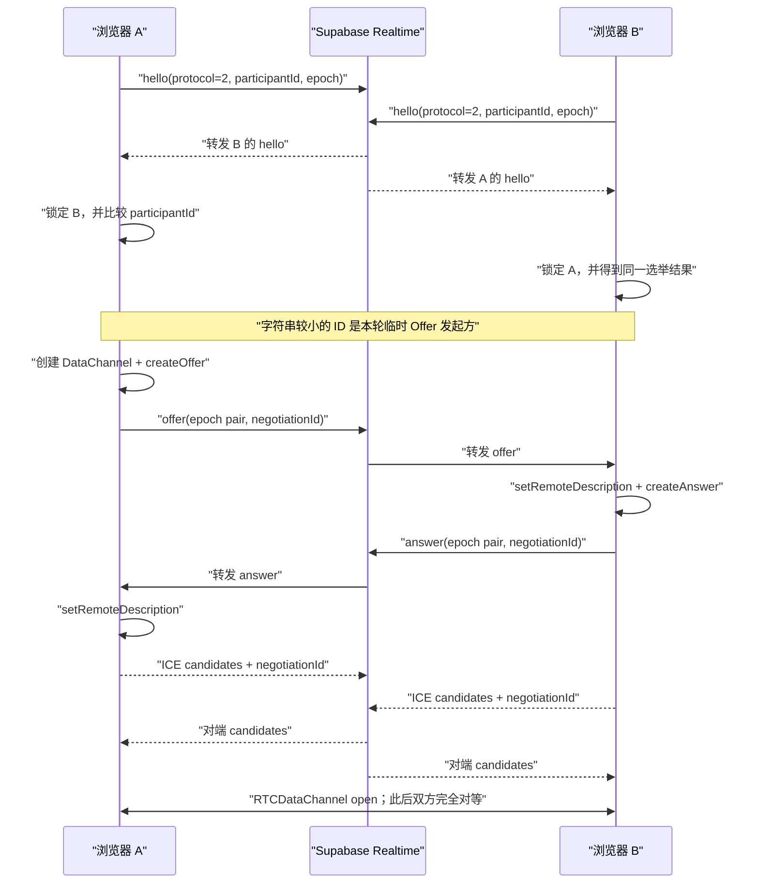

# WebRTC、双工通道与加密

## 1. 为什么仍然需要信令服务

WebRTC 定义了浏览器之间的连接能力，但不规定应用如何交换 SDP 和 ICE Candidate。TwoOnly 使用 Supabase Realtime Broadcast 作为信令总线；它帮助双方找到彼此，连接建立后不承载聊天消息。

官方说明可参考 [WebRTC Peer Connection](https://webrtc.org/getting-started/peer-connections)：Offer/Answer 描述双方能力，ICE Candidate 描述可能的网络路径，应用需要自行提供信令机制完成交换。

## 2. Offer/Answer 建连过程



图中 A 只是恰好拥有字典序更小的随机 `participantId`；下次打开页面，临时 Offer 发起方可能变成 B。这不是用户身份或权限角色。

实现中有几项可靠性保护：

- 所有信令显式标记 `protocol: 2`，旧格式不会混入 v2 状态机；
- 双方都发送 Hello，并用 `participantId` 字符串顺序确定唯一临时 Offer 发起方，避免双方同时 Offer；
- 每次协商生成 `negotiationId`，并携带发送端 `fromEpoch` 与目标 `toEpoch`，过期 Answer 会被忽略；
- 所有信令进入 Promise 队列串行处理，避免并发修改 `signalingState`；
- 重复 Offer 会复用已经生成的 Answer，而不是重复设置远端描述；
- 远端描述尚未设置时，ICE Candidate 按 `peerId + local/remote epoch + negotiationId` 分桶缓存，命中当前协商后才统一补入；
- 新会话会清空旧 peer lock 和协商状态，旧 Peer/DataChannel 回调不能覆盖新状态；
- PeerConnection 进入 `disconnected` 后先观察 2.5 秒，避免把瞬时抖动误判为断线；进入 `failed` 或 DataChannel 关闭时通常在 800 ms 后自动重握手。新一轮会递增 local epoch、双方重新 Hello，并重新选出临时 Offer 发起方；
- 用户可点击“立即重连”跳过等待。每次页面加载使用新的随机 participant ID，epoch 用来区分同一页面内的重连轮次。

## 3. 双工 DataChannel

选举出的临时 Offer 发起方在 `RTCPeerConnection` 上创建：

```ts
peer.createDataChannel("twoonly-messages", { ordered: true })
```

另一端通过 `peer.ondatachannel` 取得同一逻辑通道。通道打开后，Offer 发起方这一临时差异立即失去产品含义：双方都能调用 `send()`，也都监听 `message`，因此它是一个全双工通道，而不是“请求—响应”接口。

`ordered: true` 且未设置 `maxRetransmits` / `maxPacketLifeTime`，对应可靠、按序传输。WebRTC 规范将 `RTCDataChannel` 定义为双向数据通道，底层使用 SCTP 数据传输；参见 [W3C WebRTC Peer-to-peer Data API](https://www.w3.org/TR/webrtc/#peer-to-peer-data-api) 和 [WebRTC Data Channels](https://webrtc.org/getting-started/data-channels)。

## 4. ICE、STUN 与 TURN

`RTCPeerConnection` 从环境变量构造 ICE Server 列表：

- STUN 帮助浏览器发现 NAT 映射后的候选地址；
- ICE 尝试主机候选、反射候选等路径并选择可用候选对；
- 当直连不可达时，TURN 作为中继转发 WebRTC 流量。

当前默认 STUN：

```dotenv
NEXT_PUBLIC_STUN_URLS=stun:stun.cloudflare.com:3478,stun:stun.l.google.com:19302
```

生产稳定性通常需要 TURN。官方说明指出，许多 WebRTC 应用必须使用 TURN 处理无法直接建立 socket 的网络，参见 [WebRTC TURN server](https://webrtc.org/getting-started/turn-server)。

本项目的可执行配置步骤见 [TURN 配置手册](turn-configuration.md)。


页面通过 `RTCPeerConnection.getStats()` 找到当前 transport 实际选中的 Candidate Pair，再沿 `localCandidateId` / `remoteCandidateId` 检查候选类型：选中路径任一端是 `relay` 时显示“TURN 加密中继”，否则显示“WebRTC 点对点直连”。如果浏览器暂时没有暴露可判定的选中候选对，则只显示“WebRTC 已连接”，不会因为候选池里曾收集到 relay 就误报正在使用 TURN。该文字是运行时观测，不代表所有未来数据包永远不会切换路径。

## 5. 应用层 AES-GCM

WebRTC 自身包含 DTLS 保护。TwoOnly 在其上增加一层应用加密，使消息在进入 DataChannel 前已经成为密文。

### 密钥派生

1. 创建房间时用 `crypto.getRandomValues` 生成约 256 位随机 `secret`。
2. 浏览器计算 `SHA-256(secret)`。
3. 使用 `crypto.subtle.importKey` 把 256 位结果导入为不可导出的 AES-GCM 密钥。

这里使用 SHA-256 是因为输入本身是高熵随机秘密；如果未来改成用户短密码，必须改用带 salt 且成本可调的密码派生算法，不能继续直接哈希。

### 每条消息的加密格式

```ts
type EncryptedWire = {
  id: string;
  iv: string;    // 随机 12 字节 IV，Base64
  data: string;  // AES-GCM 密文和认证标签，Base64
};
```

AES-GCM 同时提供机密性和完整性校验；篡改 IV 或密文会导致 `decrypt()` 失败。每条消息生成独立随机 IV，避免在同一密钥下重复 nonce。算法定义见 [W3C Web Crypto API：AES-GCM](https://www.w3.org/TR/WebCryptoAPI/#aes-gcm-operations)。

当前没有把房间号、作者或协议版本放入 Additional Authenticated Data。若未来增加协议版本或可路由头部，应把这些不可加密但必须防篡改的字段加入 AAD。

## 6. 消息、图片和语音

统一明文结构：

```ts
type ChatMessage = {
  id: string;
  kind: "text" | "image" | "audio";
  content: string;
  author: "self" | "peer";
  createdAt: number;
  fileName?: string;
};
```

- 文字直接进入 `content`；
- 图片通过 `FileReader.readAsDataURL` 转成 Data URL；
- 语音通过 `getUserMedia({audio:true})` 和 `MediaRecorder` 录制，优先使用 WebM/Opus，再转成 Data URL；
- 图片和语音在编码前限制为 1.5 MB，避免浏览器内存、本地存储和 DataChannel 队列失控。

消息 JSON 先整体加密，再把密文 JSON 按 12,000 字符切成 `ChunkPacket`。接收端按消息 ID 和序号重组，只有分片完整后才执行 AES-GCM 解密。

`self / peer` 是本机 UI 方向，不是网络协议角色。方向元数据随密文记录保存在 IndexedDB；读取历史时直接使用这份本机方向，不从 URL 或旧存储猜测。

当前未实现发送背压；持续发送多个大文件可能增大 `RTCDataChannel.bufferedAmount`。正式版应设置 `bufferedAmountLowThreshold` 并等待 `bufferedamountlow`。

## 7. 本地加密历史

IndexedDB 使用两个 object store：

```text
rooms      完整房间凭证与最近活动时间
messages   按 roomId 保存 EncryptedWire 和本机方向
```

消息正文仍只保存 `EncryptedWire`，不保存明文 `ChatMessage`，每个房间保留最新 200 条。重新打开首页时可从 `rooms` 自动恢复最近会话；清空记录只删除当前设备、当前房间对应的 `messages`。

注意：

- IndexedDB 不是抗取证或硬件安全存储；能控制当前浏览器环境的脚本、扩展或本机用户可能读取密文和页面内存中的密钥。
- 清理浏览器数据、换设备或丢失完整邀请链接后，历史无法恢复。
- 对方离线时，新消息只保存在发送方本机，不会自动补发。

## 8. 安全模型

### 已保护

- Supabase 和 Vercel 不接收聊天正文；
- DataChannel 上传输的是 AES-GCM 密文；
- 本机历史保存为 AES-GCM 密文；
- 随机 IV 和 GCM 认证标签可检测传输或存储篡改；
- 安全码可辅助双方发现邀请秘密不一致。

### 未保护或未实现

- 没有账号、设备公钥、数字签名或长期身份认证；
- 不读取或保存 MAC、deviceId、浏览器指纹；同一浏览器恢复聊天只依赖 IndexedDB 中的 `roomId + secret`；
- 拿到完整邀请链接的人同时拿到房间号和加密秘密；
- 公共 Supabase topic 可被知道 roomId 的客户端订阅或干扰；
- `participantId` 和 epoch 只做结构与轮次校验，没有验签；恶意订阅者可以冒充已有 peer 干扰建连或可用性，但仍不能因此解密没有拿到密钥的聊天正文；
- 双人限制只是双方页面内存里的 peer lock；页面全部关闭后没有服务端持久席位，失效连接也允许新页面实例接替；
- 不提供前向保密的应用层密钥轮换，也不提供消息删除同步；
- SDP/ICE 等网络元数据需要经过 Supabase，TURN 中继也能观察连接元数据和流量体积，但不能读取 AES-GCM 正文。
